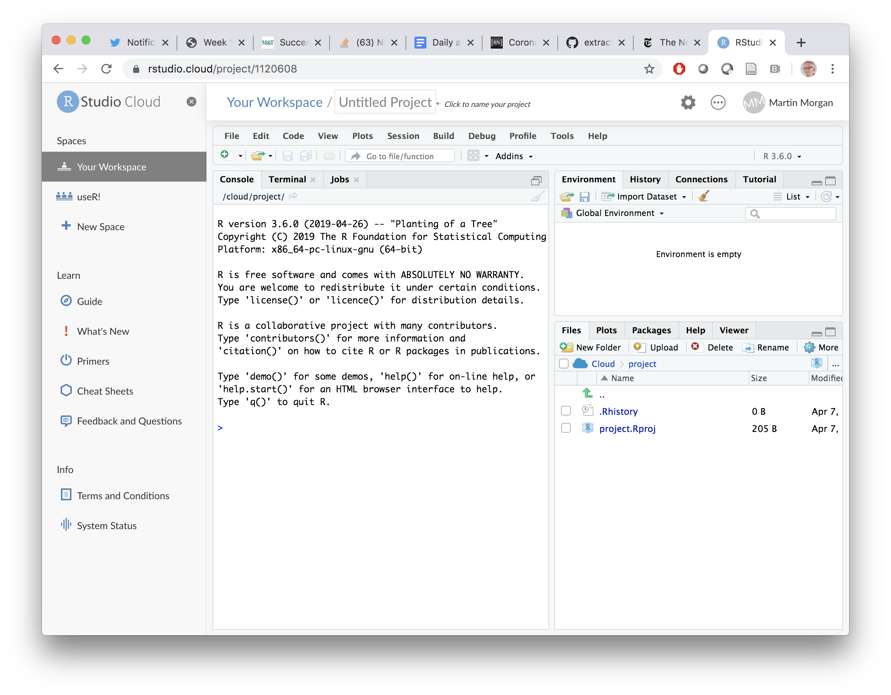
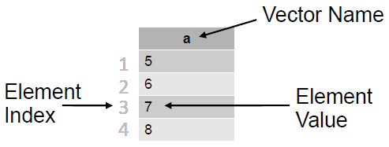

# Basics {#one}

## Day 1 (Monday) Zoom orientation

### Logistics (10 minutes)

Course material

- Available at https://mtmorgan.github.io/QuaRantine

Cadence

- Monday and Friday group zoom sessions -- these will review and troubleshoot previous material, and outline goals for the next set of independent activities.
- Daily independent activities -- most of your learning will happen here!

Communicating

- We'll use Microsoft Teams (if most participants have access to the course)
- Visit Microsoft [teams][]  and sign in with your Roswell username (e.g., `MA38727@RoswellPark.org`) and the password you use to check email, etc. Join the 'QuaRantine' team.

[teams]: https://teams.microsoft.org

### Installing _R_ and _RStudio_ (25 minutes, Shawn)


What is R?

- A programming language for statistical computing, data analysis and scientific graphics.

- Open-source with a large (and growing) user community.

- Currently in the top 10 most popular languages according to the [tiobe index][].

[tiobe index]: https://www.tiobe.com/tiobe-index/

What is [RStudio][]?

[RStudio]: https://rstudio.com/

- RStudio provides an integrated editor and shell environment to make R programming easier. Some of the more useful features include:
    - Syntax highlighting and color coding
    - Easy switching between shell and editor
    - Dynamic help and docs

Installing _R_ and _RStudio_

- Two ways to "get" RStudio:
    - Install on your laptop or desktop
        - Download the free desktop [installer here][]
    - Use the rstudio.cloud resource
        - [Visit rstudio.cloud][], sign-up, and sign-on

[installer here]:  https://rstudio.com/products/rstudio/download/#download

[Visit rstudio.cloud]: https://rstudio.cloud/

The preferred approach for this course is to try to install R and RStudio on your own computer

- Windows Users:
  - [Download R for Windows][] and run the installer. Avoid, if possible, installing as administrator.
  - [Download RStudio for Windows][] and run the installer.
  - Test the installation by launching RStudio. You should end up with a window like the screen shot below.
- Mac Users:
  - [Download R for macOS][] (OS X 10.11, El Capitan, and later) or [older macOS][] and run the installer.
  - [Download RStudio for macOS][] and run the installer.
  - Test the installation by launching RStudio. You should end up with a window like the screen shot below.

[Download R for Windows]: https://cran.rstudio.com/bin/windows/base/R-3.6.3-win.exe
[Download Rstudio for Windows]: https://download1.rstudio.org/desktop/windows/RStudio-1.2.5033.exe
[Download R for macOS]: https://cran.rstudio.com/bin/macosx/R-3.6.3.pkg
[older macOS]: https://cran.rstudio.com/bin/macosx/R-3.6.3.nn.pkg
[Download Rstudio for macOS]: https://download1.rstudio.org/desktop/macos/RStudio-1.2.5033.dmg

```{r echo = FALSE}
knitr::include_graphics('images/RStudio-screenshot.png')
```

An ALTERNATIVE, if installing on your own computer does not work:

- Do the following only if you are NOT ABLE TO INSTALL R and RStudio.
- Visit [rstudio.cloud][]. Click the 'Get Started' button, and create an account (I used my gmail account...). You should end up at a screen like the following.

    ```{r echo = FALSE}
    knitr::include_graphics('images/RStudio-cloud-screenshot.png')
    ```

- Click on the 'New Project' button, to end up with a screen like the one below. Note the 'Untitled Project' at the top of the screen; click on it to name your project, e.g., 'QuaRantine'.

    ```{r echo = FALSE}
    
    ```

[rstudio.cloud]: https://rstudio.cloud/

```{r echo = FALSE}
knitr::include_graphics('images/breakout_stop.png')
```

#### Breakout Room {-}

At this point you should have RStudio running either via your desktop installation or through rstudio.cloud. If not, please let us know via the chat window and we'll invite you to a breakout room to troubleshoot your installation.

### Basics of _R_ (25 minutes)


#### R as a simple calculator {-}

```{r}
1 + 2
```

#### R Console Output {-}

Enter this in the console:

```{r}
2 + 3 * 5
```

Q: what's the `[1]` all about in the output?

A: It's the index of the first entry in each line.

This is maybe a better example:

```{r}
1:30
```

#### Displaying help in the R Console {-}

 `? <command-name>`

- Some examples:

  ```
  ? cat
  ? print
  ```

#### Variables {-}

Naming variables in _R_

- A variable name can contain letters, numbers, and the dot `.` or underline `_` characters. Variables should start with a letter.

- Try entering these in the console:

  ` y = 2`

  `try.this = 33.3`

  `oneMoreTime = "woohoo"`

- Now try these:

  `2y = 2`

  `_z = 33.3`

  `function = "oops, my bad"`

_R_ is case sensitive (R != r)

```{r}
R = 2
r = 3
R == r
```

Variable Assignment

- You may use `=` or `<-` (and even `->`) to assign values to a variable.

  ```{r}
  x <- 2 + 3 * 5
  y =  2 + 3 * 6
  2 + 3 * 7 -> z
  cat(x, y, z)
  ```

_R_'s four basic 'atomic' data types

- Numeric (includes integer, double, etc.)
  - `3.14`, `1`, `2600`
- Character (string)
  - `"hey, I'm a string"`
  - `'single quotes are ok too'`
- Logical
  - `TRUE` or `FALSE` (note all caps)
- `NA`
  - not assigned (no known value)

Use `class()` to query the class of data:

```{r}
a <- 5
class(a)
```

Use `as.` to coerce a variable to a specific data type

```{r}
a <- as.integer(5)
class(a)
```

```{r}
d <- as.logical(a)
d
class(d)
```

#### Using Logical Operators {-}

Equivalence test (`==`):

```{r}
1 == 2
```

Not equal test (`!=`):

```{r}
1 != 2
```

less-than (`<`) and greater-than (`>`):

```{r}
18 > 44
3 < 204
```

Logical Or (`|`):

```{r}
(1 == 2) | (2 == 2)
```

Logical And (`&`):

```{r}
(1 == 2) & (2 == 2)
```

#### Objects and Vectors in R {-}

Objects

- R stores everything, variables included, in 'objects'.

```{r}
x <- 2.71

# print the value of an object
print(x)

# determine class or internal type of an object
class(x)

# TRUE if an object has not been assigned a value
is.na(x)
```

Vectors

- 'Vectors' and 'data frames' are the bread and butter of R
- Vectors consist of several elements of the <b><i>same class</b></i>
  - e.g. a vector of heart rates, one per patient

```{r echo = FALSE}

```

Data frames (`data.frame`)

- Data frames are structures that can contain columns of <b><i>various types</b></i>
  - e.g. height, weight, age, heart rate, etc.
  - Handy containers for experimental data
  - Analogous to spreadsheet data
  - More on Data Frames throughout the week!

#### Working with Vectors {-}

Creating a Vector

- Use the `c()` function

```{r}
name <- c("John Doe", "Jane Smith", "MacGillicuddy Jones", "Echo Shamus")
age <- c(36, 54, 82, 15)
favorite_color <- c("red", "orange", "green", "black")

## print the vectors
name
age
favorite_color
```

Accessing vector data

- Use numerical indexing
- R uses 1-based indexing
  - 1st vector element has index of 1
  - 2nd has an index of 2
  - 3rd has an index of 3
  - and so on

```{r}
name[1]
age[3]
```

- R supports "slicing" (i.e. extracting multiple items)

```{r}
favorite_color[c(2, 3)]
```

- Negative indices are omitted

```{r}
age[-2]
```

Some Useful Vector Operations

- `length()`: number of elements
- `sum()`: sum of all element values
- `unique()`: distinct values
- `sort()`: sort elements, omitting NAs
- `order()`: indices of sorted elements, NAs are last
- `rev()`: reverse the order
- `summary()`: simple statistics

```{r}
a <- c(5, 5, 6, 7, 8, 4)
sum(a)
length(a)
unique(a)
sort(a)
order(a)
a[order(a)]
rev(a)
summary(a)
```

Handling Missing Data

- First consider the <i>reason(s)</i> for the missing data
  - e.g. concentrations that are below detectable levels?
- Sometimes NAs in data require special statistical methods
- Other times we can safely discard / ignore NA entries
- To remove NAs prior to a calculation:

```{r}
y = c(1,NA,3,2,NA)
sum(y, na.rm=TRUE)
```

#### Wrapping up day 1 {-}

The goal for today was to rapidly cover some of the essential aspects of R programming. For the remainder of the week you'll work at your own pace to get more of a hands-on deep dive into this material. If you run into trouble please don't hesiate to ask for help via <a href="https://teams.microsoft.com">Teams</a> (QuaRantine Team), <a href = "https://quarantinecourse.slack.com/archives/C011GGP4K62">slack</a> (QuaRantine Course), or <a href="mailto:Loren.Matott@RoswellPark.org?cc=Martin.Morgan@RoswellPark.org">email</a> (Drs. Matott and Morgan) --- whatever works best for you!

## Day 2: Vectors and variables

Our overall goal for the next few days is to use _R_ to create a daily log of quarantine activities.

Our goal for today is to become familiar with _R_ vectors. Along the way we'll probably make data entry and other errors that will start to get us comfortable with _R_.

If you run into problems, reach out to the slack channel for support!

The astronaut Scott Kelly said that to survive a year on the International Space Station he found it essential to

- Follow a schedule -- plan your day, and stick to the plan
- Pace yourselves -- you've got a long time to accomplish tasks, so don't try to get everything done in the first week.
- Go outside -- if Scott can head out to space, we should be able to make it to the back yard or around the block!
- Get a hobby -- something not work related, and away from that evil little screen. Maybe it's as simple as rediscovering the joy of reading.
- Keep a journal
- Take time to connect -- on a human level, with people you work with and people you don't!
- Listen to experts -- Scott talked about relying on the mission controllers; for us maybe that's watching webinars or taking courses in new topics!
- Wash your hands!

I wanted to emphasize 'follow a schedule' and 'keep a journal'. How can _R_ help? Well, I want to create a short record of how I spend today, day 2 of my quarantine.

My first goal is to create _vectors_ describing things I plan to do today. Let's start with some of these. To get up to speed, type the following into the _R_ console, at the `>` prompt

```{r, eval = FALSE}
1 + 2
```

Press the carriage return and remind yourself that _R_ is a calculator, and knows how to work with numbers!

Now type an activity in your day, for instance I often start with

```{r, eval = FALSE}
"check e-mail"
```

Now try assigning that to a variable, and displaying the variable, e.g.,

```{r}
activity <- "check e-mail"
activity
```

OK, likely you have several activities scheduled. Create a _vector_ of a few of
these by `c`oncatenating individual values

```{r}
c("check e-mail", "breakfast", "conference call", "webinar", "walk")
```

Assign these to a variable

```{r}
activity <- c("check e-mail", "breakfast", "conference call", "webinar", "walk")
activity
```

Create another vector, but this time the vector should contain the minutes spent on each activity

```{r}
minutes <- c(20, 30, 60, 60, 60)
minutes
```

So I spent 20 minutes checking email, 30 minutes having breakfast and things like that, I was in a conference call for 60 minutes, and then attended a webinar where I learned new stuff for another 60 minutes. Finally I went for a walk to clear my head and remember why I'm doing things.

Apply some basic functions to the variables, e.g., use `length()` to demonstrate that you for each `activity` you have recorded the `minutes`.

```{r}
length(activity)
length(minutes)
```

Use `tail()` to select the last two activities (or `head()` to select the first two...)

```{r}
tail(activity, 2)
tail(minutes, 2)
```

_R_ has other types of vectors. Create a logical vector that indicates whether each activity was 'work' activity' or something you did for your own survival. We'll say that checking email is a work-related activity!

```{r}
is_work <- c(TRUE, FALSE, TRUE, TRUE, FALSE)
is_work
```

## Day 3: `factor()`, `Date()`, and `NA`

Yesterday we learned about `character`, `numeric`, and `logical` vectors in _R_ (you may need to revisit previous notes and re-create these variables)

```{r}
activity
minutes
is_work
```

Today we will learn about slightly more complicated vectors.

We created the logical vector `is_work` to classify each `activity` as either work-related or not. What if we had several different categories? For instance, we might want to classify the activities into categories inspired by astronaut Kelly's guidance. Categories might include: `connect` with others; go outside and `exercise`; `consult` experts; get a `hobby`; and (my own category, I guess) perform `essential` functions like eating and sleeping. So the values of `activity` could be classified as

```{r}
classification <-
    c("connect", "essential", "connect", "consult", "exercise")
```

I want to emphasize a difference between the `activity` and `classification` variables. I want `activity` to be a character vector that could contain any description of an activity. But I want `classification` to be terms only from a limited set of possibilities. In _R_, I want `classification` to be a special type of vector called a `factor`, with the _values_ of the vector restricted to a set of possible _levels_ that I define. I create a factor by enumerating the possible _levels_ that the factor can take on

```{r}
levels <- c("connect", "exercise", "consult", "hobby", "essential")
```

And then tell _R_ that the vector `classification` should be a factor with values taken from a particular set of levels

```{r}
classification <- factor(
    c("connect", "essential", "connect", "consult", "exercise"),
    levels = levels
)
classification
```

Notice that activity (a character vector) displays differently from classification (a factor)

```{r}
activity
classification
```

Also, some of the levels (e.g., `hobby`) have not been part of our schedule yet, but the factor still 'knows' about the level.

Notice also what happens when I try to use a value (`disconnect`) that is not a level of a factor

```{r}
factor(c("connect", "disconnect"), levels = levels)
```

The value with the unknown level is displayed as `NA`, for 'not known'. `NA` values can be present in any vector, e.g.,

```{r}
c(1, 2, NA, 4)
c("walk", "talk", NA)
c(NA, TRUE, FALSE, TRUE, TRUE)
```

This serves as an indication that the value is simply not available. Use `NA` rather than adopting some special code (e.g., '-99') to indicate when a value is not available.

One other type of vector we will work a lot with are dates. All of my activities are for today, so I'll start with a character vector with the same length as my activity vector, each indicating the date in a consistent month-day-year format

```{r}
dates <- c("04-14-2020", "04-14-2020", "04-14-2020", "04-14-2020", "04-14-2020")
dates
```

Incidentally, I could do this more efficiently using the `rep`licate function

```{r}
rep("04-14-2020", 5)
```

And even better use `length()` to know for sure how many times I should replicate the character vector

```{r}
rep("04-14-2020", length(activity))
```

`dates` is a character vector, but it has specially meaning as a calendar date, _R_ has a `Date` _class_ that knows how to work with dates, for instance to calculate the number of days between two dates. We will _coerce_ `date` to an object of class `Date` using a function `as.Date`. Here's our first attempt...

```{r, eval = FALSE}
as.Date(dates)
```
... but this results in an error:

```
Error in charToDate(x) :
  character string is not in a standard unambiguous format
```

_R_ doesn't know the format (month-day-year) of the dates we provide. The solution is to add a second argument to `as.Date()`. The second argument is a character vector that describes the date format. The format we use is `"%m-%d-%Y"`, which says that we provide the `%m`onth first, then a hyphen, then the `%d`ay, another hyphen, and finally the four-digit `%Y`ear.

```{r}
as.Date(dates, format = "%m-%d-%Y")
```

Notice that the format has been standardized to year-month-day. Also notice that although the original value of `date` and the return from `as.Data()` look the same, they are actually of different _class_.

```{r}
class(date)
class(as.Date(dates, format = "%m-%d-%Y"))
```

_R_ will use the information about class to enable specialized calculation on dates, e.g., to sort them or to determine the number of days between different dates. So here's our `date` vector as a `Date` object.

```{r}
dates <- rep("04-14-2020", length(activity))
date <- as.Date(dates, format = "%m-%d-%Y")
date
```

OK, time for a walk! See you tomorrow!

## Day 4: Working with variables

Remember that _R_ can act as a simple calculator, and that one can create new variables by assignment

```{r}
x <- 1
x + 1
y <- x + 1
y
```

Let's apply these ideaas to our `minutes` vector from earlier in the week.

```{r}
minutes <- c(20, 30, 60, 60, 60)
```

We can perform basic arithmetic on vectors. Suppose we wanted to increase the time of each activity by 5 minutes

```{r}
minutes + 5
```

or to increase the time of the first two activities by 5 minutes, and the last three activities by 10 minutes

```{r}
minutes + c(5, 5, 10, 10, 10)
```

_R_ has a very large number of _functions_ that can be used on vectors. For instance, the average time spent on activities is

```{r}
mean(minutes)
```

while the total amount of time is

```{r}
sum(minutes)
```

Explore other typical mathematical transformations, e.g., `log()`, `log10()`, `sqrt()` (square root), ... Check out the help pages for each, e.g., `?log`.

Explore the consequences of `NA` in a vector for functions like `mean()` and `sum()`.

```{r}
x <- c(1, 2, NA, 3)
mean(x)
```

_R_ is saying that, since there is an unknown (`NA`) value in the vector, it cannot possibly know what the mean is! Tell _R_ to remove the missing values before performing the calculation by adding the `na.rm = TRUE` argument

```{r}
mean(x, na.rm = TRUE)
```

Check out the help page `?mean` to find a description of the `na.rm` and other arguments.

It's possible to perform logical operations on vectors, e.g., to ask which activities lasted 60 minutes or more

```{r}
minutes >= 60
```

Here's our `activity` vector

```{r}
activity <- c("check e-mail", "breakfast", "conference call", "webinar", "walk")
```

The elements of this vector are numbered from 1 to 5. We can create a new vector that is a subset of this vector using `[` and an integer index, e.g., the second activity is

```{r}
activity[2]
```

The index can actually be a vector, so we could choose the second and fourth activity as

```{r}
index <- c(2, 4)
activity[index]
```

In fact, we can use logical vectors for subsetting. Consider the activities that take sixty minutes or longer:

```{r}
index <- minutes >= 60
activity[index]
```

We had previously characterized the activities as 'work' or otherwise.

```{r}
is_work <- c(TRUE, FALSE, TRUE, TRUE, FALSE)
```

Use `is_work` to subset `activity` and identify the work-related activities

```{r}
activity[is_work]
```

How many minutes were work-related?

```{r}
work_minutes <- minutes[is_work]
sum(work_minutes)
```

What about not work related? `!` negates logical vectors, so

```{r}
is_work
!is_work
non_work_minutes <- minutes[!is_work]
sum(non_work_minutes)
```

Note that it doesn't make sense to take the `mean()` of a character vector like `activity`, and _R_ signals a warning and returns `NA`

```{r}
mean(activity)
```

Nonetheless, there are many functions that _do_ work on character vectors, e.g., the number of letters in each element `nchar()`, or transformation to upper-case

```{r}
nchar(activity)
toupper(activity)
```

## Day 5 (Friday) Zoom check-in

### Review and trouble shoot (25 minutes; Martin)

Data representations

- 'Atomic' vectors

    ```{r}
    activity <- c("check e-mail", "breakfast", "conference call", "webinar", "walk")
    minutes <- c(20, 30, 60, 60, 60)
    is_work <- c(TRUE, FALSE, TRUE, TRUE, FALSE)
    ```

- `factor()` and `date()`

    ```{r}
    levels <- c("connect", "exercise", "consult", "hobby", "essential")
    classification <- factor(
        c("connect", "essential", "connect", "consult", "exercise"),
        levels = levels
    )

    dates <- rep("04-14-2020", length(activity))
    date <- as.Date(dates, format = "%m-%d-%Y")
    ```

- missing values

    ```{r}
    x <- c(1, 3, NA, 5)
    sum(x)
    sum(x, na.rm = TRUE)

    factor(c("connect", "disconnect"), levels = levels)
    ```

- functions and logical operators

    ```{r}
    x <- c(1, 3, NA, 5)
    sum(x)
    sum(x, na.rm = TRUE)

    minutes >= 60
    ```

Subsetting vectors

- 1-basaed numeric indexes

    ```{r}
    activity

    idx <- c(1, 3, 1)
    activity[idx]
    ```

- logical index

    ```{r}
    is_work
    activity[is_work]

    sum(minutes[is_work])
    ```

-  Maybe more interesting...

    ```{r}
    short <- minutes < 60
    short
    minutes[short]
    activity[short]
    ```

Other fun topics

- `%in%`: a _binary operator_ -- is each of the vector elements on the left-hand side _in_ the set of elements on the right hand side

    ```{r}
    fruits <- c("banana", "apple", "grape", "orange", "kiwi")
    c("apple", "orange", "hand sanitizer") %in% fruits
    ```

- _named_ vectors (see [Annual Estimates...][fun:1] table from [census.gov][fun:2])

  Define a named vector

    ```{r}
    state_populations <- c(
        Alabama = 4903185, Alaska = 731545, Arizona = 7278717, Arkansas = 3017804,
        California = 39512223, Colorado = 5758736, Connecticut = 3565287,
        Delaware = 973764, `District of Columbia` = 705749, Florida = 21477737,
        Georgia = 10617423, Hawaii = 1415872, Idaho = 1787065, Illinois = 12671821,
        Indiana = 6732219, Iowa = 3155070, Kansas = 2913314, Kentucky = 4467673,
        Louisiana = 4648794, Maine = 1344212, Maryland = 6045680, Massachusetts = 6892503,
        Michigan = 9986857, Minnesota = 5639632, Mississippi = 2976149,
        Missouri = 6137428, Montana = 1068778, Nebraska = 1934408, Nevada = 3080156,
        `New Hampshire` = 1359711, `New Jersey` = 8882190, `New Mexico` = 2096829,
        `New York` = 19453561, `North Carolina` = 10488084, `North Dakota` = 762062,
        Ohio = 11689100, Oklahoma = 3956971, Oregon = 4217737, Pennsylvania = 12801989,
        `Rhode Island` = 1059361, `South Carolina` = 5148714, `South Dakota` = 884659,
        Tennessee = 6829174, Texas = 28995881, Utah = 3205958, Vermont = 623989,
        Virginia = 8535519, Washington = 7614893, `West Virginia` = 1792147,
        Wisconsin = 5822434, Wyoming = 578759
    )
    ```

  Computations

    ```{r}
    ## US population
    sum(state_populations)

    ## smallest states
    head(sort(state_populations))

    ## largest states
    head(sort(state_populations, decreasing = TRUE))

    ## states with more than 10 million people
    big <- state_populations[state_populations > 10000000]
    big
    names(big)
    ```

  Subset by name

    ```{r}
    ## populations of California and New York
    state_populations[c("California", "New York")]
    ```

[fun:1]: https://www2.census.gov/programs-surveys/popest/tables/2010-2019/state/totals/nst-est2019-01.xlsx

[fun:2]: https://www.census.gov/data/datasets/time-series/demo/popest/2010s-state-total.html

### Weekend activities (25 minutes; Shawn)

#### Writing _R_ scripts {-}

_R_ scripts are convenient text files that we can use to save one or more lines of _R_ syntax. Over the weekend you will get some experience working with _R_ scripts.  The example below will help you be a bit more prepared. 

- In RStudio, click `File --> New File --> R Script` to create a new script file and open it in the editor.

If you've followed the daily coding activities throughout the week, you should have some R code that keeps track of your daily activities.

- If so, enter that code into your _R_ script now.

- Otherwise, feel free to use the code below. Look for a `copy to clipboard` icon in the top-right of the code block. To copy the code block to your _R_ script:
  - Click on the `copy to clipboard` icon 
  - Place your cursor in your _R_ script 
  - Click `Edit --> Paste`:

```{r eval=FALSE}
# ====================================================================
# day 1 information 
# ====================================================================
day1_activity = c("breakfast", 
                  "check e-mail", 
                  "projects",
                  "conference call", 
                  "teams meeting", 
                  "lunch", 
                  "conference call", 
                  "webinar")
n = length(day1_activity)
day1_is_work = c(FALSE,TRUE,TRUE,TRUE,TRUE,FALSE,TRUE,TRUE)
day1_minutes = c(30, 75, 120, 30, 60, 30, 60, 120)
day1_total_hours = sum(day1_minutes) / 60
day1_work_hours = sum(day1_minutes[day1_is_work == TRUE]) / 60
cat("Total time recorded for day 1 : ", day1_total_hours,  
    "hours, over", n, "activities\n")
cat("Total time working  for day 1 : ", day1_work_hours, "hours \n\n")
```

Recall the discussion of factors and levels in Day 3; the code below leverages this but adds another level named `independent work`.

- If you've already got code to assign factors and levels to your daily activity, enter that code into your _R_ script now.

- Otherwise, feel free to use the code below via the `copy to clipboard` procedure outlined above:

```{r eval=FALSE}
# ====================================================================
# Kelly, Morgan, and Matott's classification strategy
# ====================================================================
kmm_levels = c("connect", 
              "exercise", 
              "consult", 
              "hobby", 
              "essential",
              "independent work")
# manually map day 1 activity to appropriate kmm_levels
day1_classes = factor(
    c("essential", "connect", "independent work",
      "connect", "connect",  "essential", 
      "connect", "consult"), levels = kmm_levels)
```

<hr>
<i>[OPTIONAL ADVANCED MATERIAL]</i>

Earlier today Dr. Morgan touched on named vectors. We can leverage named vectors to create a more general mapping between activities and levels. The code for this is given below. Try it and compare the result to your manual mapping!

```{r eval=FALSE}
# kmm_map is a named vector that maps activities to categories
kmm_map = c("breakfast"       = "essential", 
            "check e-mail"    = "connect", 
            "projects"        = "independent work",
            "requests"        = "independent work",
            "conference call" = "connect",
            "teams meeting"   = "connect", 
            "lunch"           = "essential", 
            "webinar"         = "consult",
            "walk"            = "exercise")
day1_classes = factor(kmm_map[day1_activity], levels = kmm_levels)
```
<hr>

On day 3 you also got some experience working with dates. The code below stamps our day 1 activity data with an appropriately formatted date.

- If you've already got code to assign dates your daily activity, enter that code into your R script now.

- Otherwise, feel free to use the code below via the `copy to clipboard` procedure outlined above:

```{r eval=FALSE}
# ====================================================================
# Assign dates
# ====================================================================
day1_dates = rep("04-13-2020",length(day1_activity))
day1_dates = as.Date(day1_dates,format = "%m-%d-%Y")
```

#### Saving _R_ scripts {-}

If you've been following along you should now have an _R_ script that contains a bunch of code for keeping track of your daily activity log. Let's save this file: 

- In RStudio, place your cursor anywhere in the script file 
- click `File --> Save` (or press `CTRL+S`)
  - Name your file something like `daily_activity.R`.
  
#### Running _R_ scripts {-}

Now that we've created an _R_ script you may be wondering "How do I run the code in the script?" There's actually a few ways to do this:

Option #1 (Run)

- <mark>Highlight</mark> the first block of the code (e.g the part where you recorded day 1 activity and maybe calculated amount of time worked). 
- Click the `--> Run` icon in the top-right portion of the script editor window. 
  - This will run the highlighted block of code. The output will appear in the RStudio console window along with an echo of the code itself.
  
Option #2 (Source)

- Click on the `--> Source` icon just to the right of the `--> Run` icon.
  - This will run the entire script. Apart from a single `source()` command, only the output generated by `print()` and `cat()` will appear in the RStudio console (i.e. the code in the script is not echoed to the console).
  
Option #3 (Source with Echo)

- Click on the downward pointing arrowhead next to the source buton to open a dropdown menu
- In the dropdown menu, sectect `Source with Echo`
  - This will run the entire script and the code in the script will be echoed to the RStudio console along with any output generated by `print()` and `cat()`. 
  - The echoed source and the normal output are not color-coded like they are when using the `--> Run` button.

#### Saving data {-}

It can be useful to save objects created in an _R_ script as a data file. These data files can be loaded or re-loaded into a new or existing _R_ session. 

For example, let's suppose you had an _R_ script that mined a trove of Twitter feeds for sentiment data related to government responses to COVID-19. Suppose you ran the script for serveral weeks and collected lot's of valuable data into a bunch of vectors. Even though the _R_ code is saved as a script file, the data that the script is collecting would be lost once script stops running. Furthermore, due to the temporal nature of Twitter feeds, you wouldn't be able to collect the same data by simply re-running the script. Luckily, _R_ provides several routines for saving and loading objects. Placing the appropriate code in your _R_ script will ensure that your data is preserved even after the script stops running.

#### Saving individual _R_ ojbects {-}

_R_ supports storing a single _R_ object as an `.rds` file. For example, the code below saves the `day1_activity` vector to an `.rds` file. The `saveRDS()` function is the workhorse in this case and the `setwd()`, `getwd()`, and `paste()` commands allow us to conveniently specify a name and location for the data file:

```{r eval=FALSE}
# ====================================================================
# creating .rds data files (for saving individual objects)
# ====================================================================
setwd("C:/Matott/MyQuarantine")
my_rds_file = paste(getwd(),"day1_activity.rds",sep="/")
print(my_rds_file)
saveRDS(day1_activity, my_rds_file)
```

#### Loading individual _R_ ojbects {-}

The complement to the `saveRDS()` function is the `readRDS()` function. It loads the _R_ object stored in the specified file. In the example below a data file is loaded and stored as an object named `day1_activity_loaded`. Compare this object to the existing `day1_activity` object - they should be the same!

```{r eval=FALSE}
# ====================================================================
# Reading .rds data files (for loading individual objects)
# ====================================================================
setwd("C:/Matott/MyQuarantine")
my_rds_file = paste(getwd(),"day1_activity.rds",sep="/")
print(my_rds_file)
day1_activity_loaded = readRDS(my_rds_file) # now load from disk
```
#### Saving multiple _R_ ojbects {-}

The `save()` function will save one or more objects into a `.Rdata` file (these are also known as `session` files). The example below saves various `day1` and related factor-level objects to an `.Rdata` file.

```{R eval=FALSE}
# ====================================================================
# creating .RData files (for saving multiple objects)
# ====================================================================
setwd("C:/Matott/MyQuarantine")
my_rdata_file = paste(getwd(),"day1.rdata",sep="/")
save(kmm_levels, kmm_map,
     day1_activity, day1_classes, day1_dates, day1_is_work, 
     day1_minutes, day1_total_hours, day1_work_hours, 
     file = my_rdata_file)
```

If you have many objects that you want to save, listing them all can be tedious. Fortunately, the `ls()` command provides a list of <i>all</i> objects in the current _R_ session. The results of `ls()` can be passed along to the `save()` command and this will result in all objects being saved. An example of the required syntax is given below.

```{R eval=FALSE}
setwd("C:/Matott/MyQuarantine")
my_rdata_file = paste(getwd(),"day1.rdata",sep="/")
save(list = ls(), file = my_rdata_file)
```

#### Loading multiple _R_ ojbects {-}

The complement to the `save()` function is the `load()` function. This will load all objects stored in an `.Rdata` file into the current _R_ session. Example syntax is given below:

```{r eval=FALSE}
# ====================================================================
# Reading .RData files (for loading multiple objects)
# ====================================================================
setwd("C:/Matott/MyQuarantine")
my_rdata_file = paste(getwd(),"daily_activity.rdata",sep="/")
load(my_rdata_file) # reload
```

It is also possible to load an `.Rdata` file using the RStudio interface.

- Click `Session --> Load Workspace ...`
- A file browser dialog will open 
- Navigate to the .rdata file and select  

#### Wrapping up day 5 {-}

Today we reviewed the concepts that you worked with throughout the week during your independent activity. We also troubleshooted any problems or questions that may have come up during this time. Finally, we previewed the creation and use of _R_ scripts and learned about saving and loading objects. Over the weekend you will gain some more experience with these topics.

## Day 6: _R_ scripts

Some of you may have already started saving your R commands as script files. As the material gets more complicated (and more interesting) everyone will want to start doing this. Here is an example to get you started:

- Recall that we can create a script file in RStudio, click "File --> New File --> R Script" to create a new script file and open it in the editor

```{r echo = FALSE, fig.align="center", out.width="60%"}
knitr::include_graphics('images/rstudio_new_rscript_file.png')
```

- By convention, R scripts have a .R exstension (e.g. my_script.R)
  - In RStudio, click into your untitled script and click "File --> Save"
  - Name your file something fun like `my_first_script.R` and save it

- Use the `#` character for comments. Enter the following into your R Script file:

```{r}
## This is my first R script
```

- Enter each command on a separate line. It's also possible to enter multiple (short!) commands on a single line, separated by a semi-colon `;`

```{r results="hide"}
x = "Hello world!"
y = 'Today is'; d = format(Sys.Date(), "%b %d, %Y")
cat(x, y, d)
```

- Use the "Run" button in RStudio to run the highlighted portion of an R script file. Try this on your simple R Script.

```{r echo = FALSE, fig.align="center", out.width="80%"}
knitr::include_graphics('images/rstudio_run_button.png')
```

```{r}
x = "Hello world!"; y = 'Today is'; d = format(Sys.Date(),"%b %d, %Y")
cat(x, y, d, "\n")
```

- Alternatively, use "Run --> Run All" to run an entire script file.

For today's exercise, create a script file that summarizes your quarantine activities over several days. Use comments, white space (blank lines and spaces), and variable names to summarize each day. Here's what I've got...

```{r}
## 'classification' factor levels
levels <- c("connect", "exercise", "consult", "hobby", "essential")

## Quarantine log, day 1

activity_day_1 <-
    c("check e-mail", "breakfast", "conference call", "webinar", "walk")
minutes_day_2 <- c(20, 30, 60, 60, 60)
is_work_day_2 <- c(TRUE, FALSE, TRUE, TRUE, FALSE)
classification_day_2 <- factor(
    c("connect", "essential", "connect", "consult", "exercise"),
    levels = levels
)
date_day_1 <- as.Date(rep("04-14-2020", length(activity_day_1)), "%m-%d-%Y")

## Quarantine log, day 2

activity_day_2 <-
    c("check e-mail", "breakfast", "conference call", "webinar", "read a book")
minutes_day_2 <- c(20, 30, 60, 60, 60)
is_work_day_2 <- c(TRUE, FALSE, TRUE, TRUE, FALSE)
classification_day_2 <- factor(
    c("connect", "essential", "connect", "consult", "hobby"),
    levels = levels
)
date_day_2 <- as.Date(rep("04-15-2020", length(activity_day_2)), "%m-%d-%Y")

## Quarantine log, day 3

activity_day_3 <-
    c("check e-mail", "breakfast", "webinar", "read a book")
minutes_day_3 <- c(20, 30, 60, 60)
is_work_day_3 <- c(TRUE, FALSE, TRUE, FALSE)
classification_day_3 <- factor(
    c("connect", "essential", "connect", "consult", "hobby"),
    levels = levels
)
date_day_3 <- as.Date(rep("04-16-2020", length(activity_day_3)), "%m-%d-%Y")
```

Try `c`oncatenating these values, e.g.,

```{r}
activity <- c(activity_day_1, activity_day_2, activity_day_3)
activity
```

Save your script, quit _R_ and _RStudio_, and restart _R_. Re-open and run the script to re-do your original work.

Think about how this makes your work _reproducible_ from one day to the next, and how making your scientific work reproducible would be advantageous.

## Day 7: Saving data

We've defined these variables

```{r}
activity <- c("check e-mail", "breakfast", "conference call", "webinar", "walk")
minutes <- c(20, 30, 60, 60, 60)
is_work <- c(TRUE, FALSE, TRUE, TRUE, FALSE)

levels <- c("connect", "exercise", "consult", "hobby", "essential")
classification <- factor(
    c("connect", "essential", "connect", "consult", "exercise"),
    levels = levels
)

dates <- rep("04-14-2020", length(activity))
date <- as.Date(dates, format = "%m-%d-%Y")
```

Individual variables can be saved to a file.

- Define the _path_ to the file. The file extension is, by convention, '.rds'. We'll use a temporary location

    ```{r}
    temporary_file_path <- tempfile(fileext = ".rds")
    ```

  ...but we could have chosen the destination interactively

    ```{r, eval = FALSE}
    interactive_file_path <- file.choose(new = TRUE)
    ```

  ...or provided path relative to the 'current working directory', or an absolute file path (use '/' to specify paths on all operating systems, including Windows)


    ```{r, eval = FALSE}
    getcwd()
    relative_file_path <- "my_activity.rds"
    absolute_file_path_on_macOS <- "/Users/ma38727/my_activity.rda"
    ```

- use `saveRDS()` to save a single object to a file

    ```{r}
    saveRDS(activity, temporary_file_path)
    ```
    
- use `readRDS()` to read the object back in

    ```{r}
    activity_from_disk <- readRDS(temporary_file_path)
    activity_from_disk
    ```

Use `save()` and `load()` to save and load several objects.

- Use `.RDaata` as the file extension.Usually we would NOT save to a temporary location, because the temporary location would be deleted when we ended our _R_ session.

	```{r}
	temporary_file_path <- tempfile(fileext = ".RData")
	save(activity, minutes, file = temporary_file_path)
	```

- Remove the objects from the _R_ session, and verify that they are absent

	```{r}
	rm(activity, minutes)
	try(activity) # fails -- object not present
	```

- Load the saved objects

    ```{r}
    load(temporary_file_path)
    activity
    ```

As an exercise...

- Chose a location to save your data, e.g., in the current working direcotry

    ```{r}
    getwd()    # Where the heck are we?
    my_file_path <- "my_quaRantine.RData"
    ```

- Save the data

    ```{r, echo = FALSE}
    .my_file_path <- my_file_path <- tempfile()
    ```

    ```{r}
    save(activity, minutes, is_work, classification, date, file = my_file_path)
    ```
    
- Now the moment of truth. Quit _R_ without saving your workspace

    ```{r, eval = FALSE}
    quit(save = FALSE)
    ```
    
    ```{r, echo = FALSE}
    rm(list = ls())
    ```
    
- Start a new session of _R_, and verify that your objects are not present

    ```{r}
    ls() # list objects available in the '.GlobalEnv' -- there should be none
    try(activity) # nope, not there...
    ```

- Create a path to the saved data file

    ```{r, eval = FALSE}
    my_file_path <- "my_quaRantine.RData"
    ```
    
    ```{r, echo = FALSE}
    my_file_path <- .my_file_path
    ```

- Load the data and verify that it is correct

    ```{r}
    load(my_file_path)
    activity
    minutes
    is_work
    date
    classification
    ```
    
See you in zoom on Monday!
