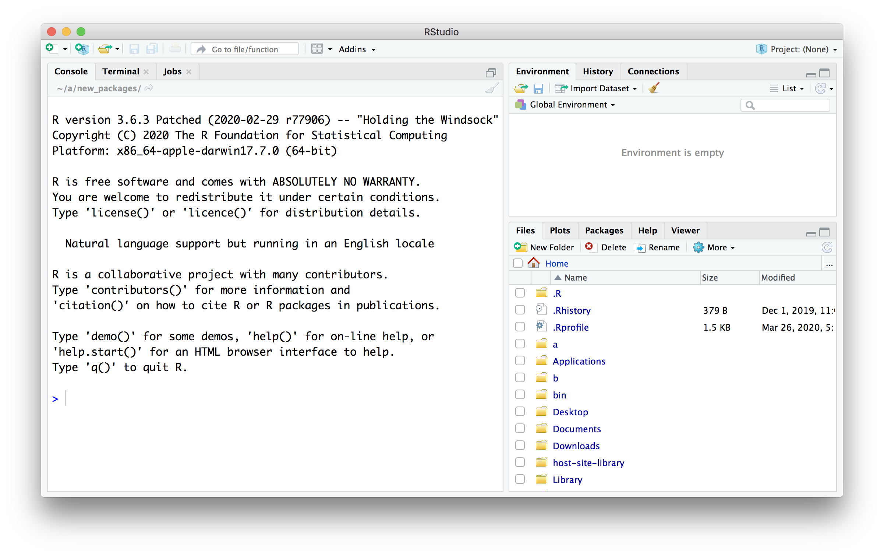
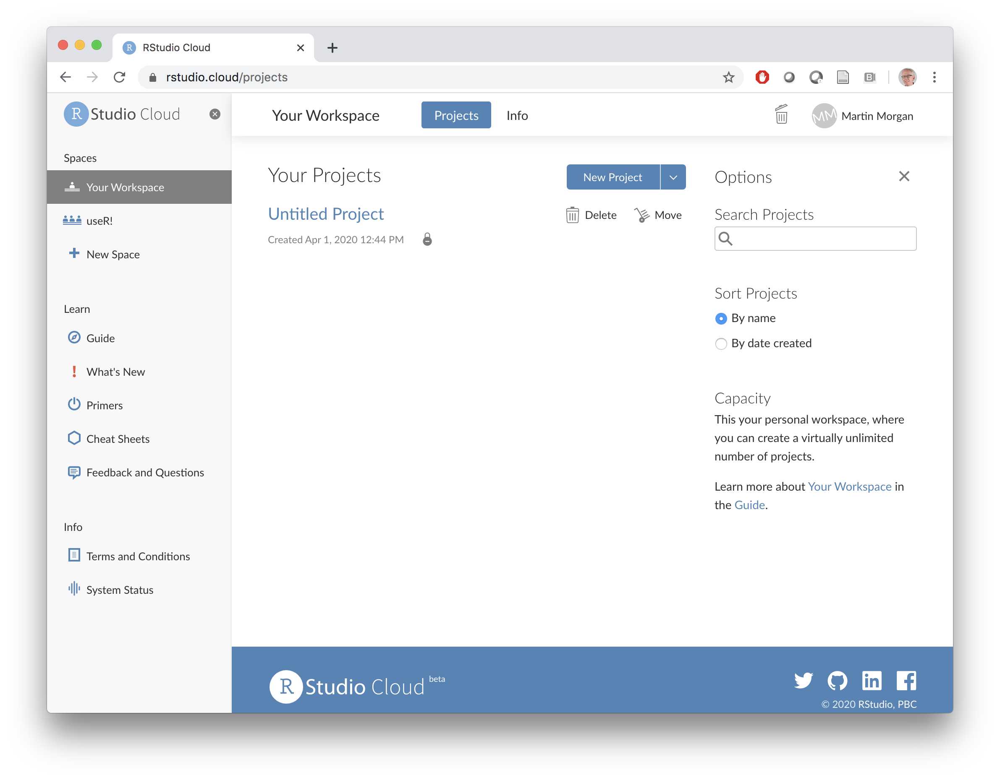

# Basics {#one}

## Day 1 (Monday) Zoom orientation

### Logistics (10 minutes, Adam)

Course material

- Available at https://mtmorgan.github.io/QuaRantine

Microsoft TEAMS

- Visit https://teams.microsoft.org and sign in with your Roswell username (e.g., `MA38727@RoswellPark.org`) and the password you use to check email, etc.
- Join the QuaRantine team

### Installing _R_ and _RStudio_ (25 minutes, Shawn)

Try to install R and RStudio on your own computer

Windows:

- [Download R for Windows][] and run the installer. Avoid, if possible, installing as administrator.
- [Download RStudio for Windows][] and run the installer.
- Test the installation by launching RStudio. You should end up with a window like the screen shot below.

[Download R for Windows]: https://cran.rstudio.com/bin/windows/base/R-3.6.3-win.exe
[Download Rstudio for Windows]: https://download1.rstudio.org/desktop/windows/RStudio-1.2.5033.exe

Mac:

- [Download R for macOS][] (OS X 10.11, El Capitan, and later) or [older macOS][] and run the installer.
- [Download RStudio for macOS][] and run the installer.
- Test the installation by launching RStudio. You should end up with a window like the screen shot below.

[Download R for macOS]: https://cran.rstudio.com/bin/macosx/R-3.6.3.pkg
[older macOS]: https://cran.rstudio.com/bin/macosx/R-3.6.3.nn.pkg
[Download Rstudio for macOS]: https://download1.rstudio.org/desktop/macos/RStudio-1.2.5033.dmg 



ALTERNATIVELY;

- Do the following only if you are NOT ABLE TO INSTALL R and RStudio:
- Visit [rstudio.cloud][]. Click the 'Get Started' button, and create an account. You should end up at a screen like the following.



[rstudio.cloud]: https://rstudio.cloud/

### Basics of _R_ (25 minutes, Martin)

A simple calculator

```{r}
1 + 2
```

Variables

Vectors

The versatile `data.frame`

Scripting


## Day 2

Creating a daily log of quarantine activities -- create a `data.frame` logging activities. Save to / read from a file.

## Day 3

Add to a `data.frame`. Basic statistical summary and visualization.

## Day 4

## Day 5 (Friday) Zoom check-in

Participant progress / challenges. Introduction to a COVID-19 data set documenting cases reported in the US.

### Review and trouble shoot (25 minutes)

### Next week (25 minutes)

## Day 6

Installing tidyverse

## Day 7

Input COVID-19 data. Statistical summary.
