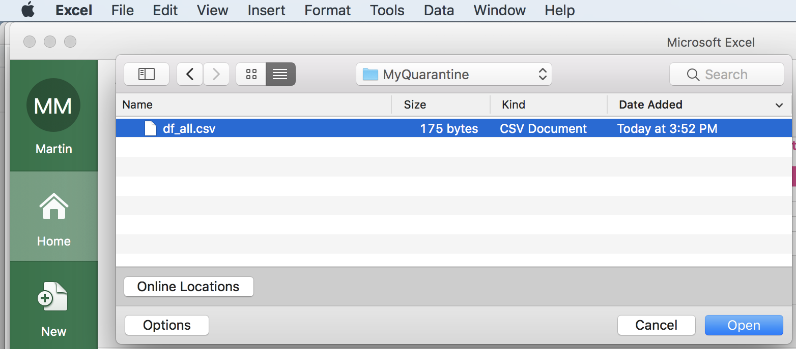
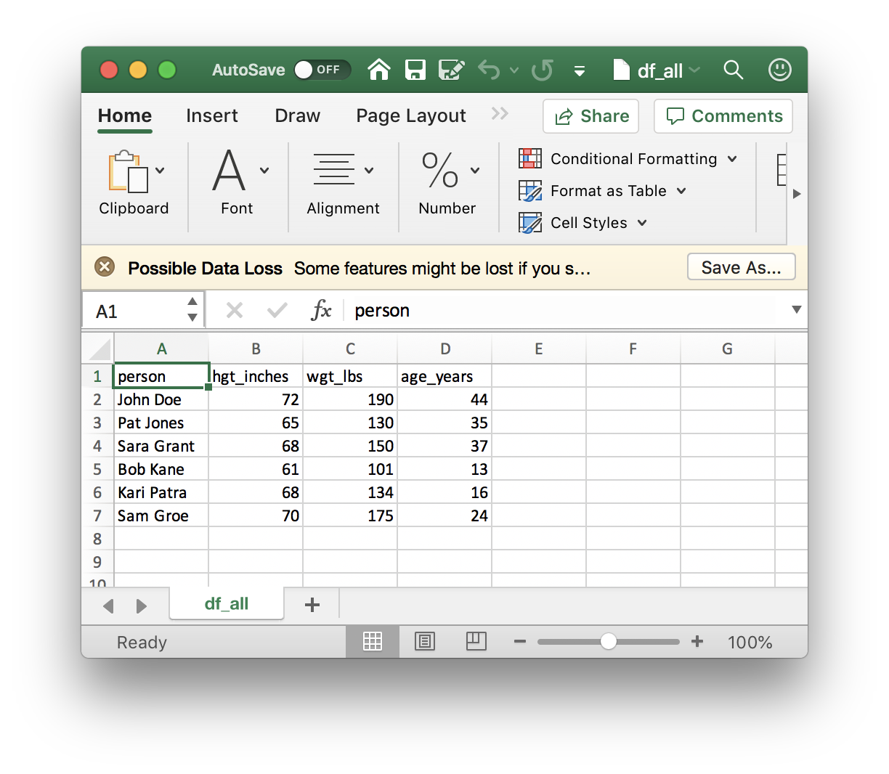
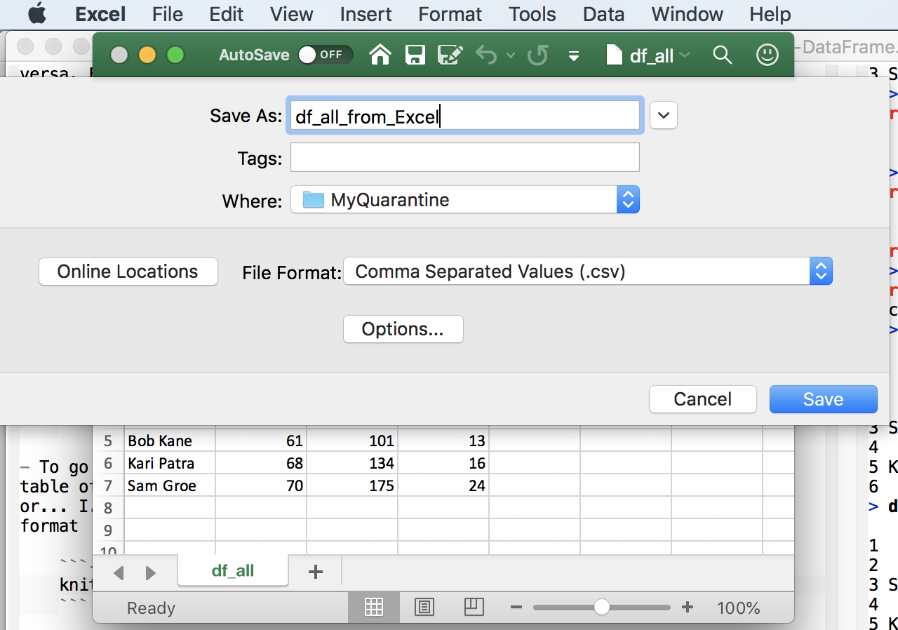

# The data frame {#two}

## Day 8 (Monday) Zoom check-in

### Logistics {-}

- Remember to use the [QuaRantine][] Microsoft Team. Your Roswell credentials are required, and you must have been invited (by Adam.Kisailus at RoswellPark.org)

- We're thinking of having a 'networking' hour after Friday's class (so 3pm and after) where we'll break into smaller groups (if necessary) and provide an opportunity for people to turn on their video and audio so that we can increase the amount of intereaction. Likely the first networking hour will be a round of introductions / what you hope to get out of the course / etc., and maybe brief discussion of topics arising.

[QuaRantine]: https://teams.microsoft.com/l/channel/19%3a44e8ed2b03db4d28bac6a212ed67717d%40thread.tacv2/General?groupId=02d8c183-5110-4504-b201-ace342eb6e2b&tenantId=08beaa21-c9ff-428a-b8f5-53c03dad1941

### Review and troubleshoot (15 minutes) {-}

Saving and loading objects

Scripts

### The data frame (40 minutes) {-}

#### Concept {-}

Recall from Day 1:

- Data frames are handy containers for experimental data.

- Like a spreadsheet, a data frame has rows and columns

- The columns of a data frame contain measurements describing each individual

  - Each measurement could refer to a different type of object (numeric, string, etc.)
  - Measurements could be physical observations on samples, e.g., `height`, `weight`, `age`, `minutes` an activity lasts, etc.
  - Measurements might also describe how the row is classified, e.g., `activity`, `is work?`, `classification`, `date`, etc.

- The rows of a data frame represent a 'tuple' of measurements corresponding to an experimental observation, e.g.,

  - Note: you must ensure units are consistent across tuples!

- Rows and columns can be assigned names.

#### Create a simple data frame {-}

```{r}
heights <- c(72, 65, 68)
weights <- c(190, 130, 150)
ages <-  c(44, 35, 37)
df <- data.frame(heights, weights, ages)
df
```

It's possible to update the column names, and to provide row names...

```{r}
named_df <- data.frame(heights, weights, ages)
colnames(named_df) <- c("hgt_inches", "wgt_lbs", "age_years")
rownames(named_df) <- c("John Doe", "Pat Jones", "Sara Grant")
named_df
```

...but it's often better practice to name columns at time of creation, and to store all information as columns (rather than designating one column as a 'special' row name)

- Here's our first attempt

    ```{r}
    data.frame(
        person = c("John Doe", "Pat Jones", "Sara Grant"),
        hgt_inches = heights, wgt_lbs = weights, age_years = ages
    )
    ```

- It's unsatisfactory because by default _R_ treats character vectors as `factor`. We'd like them to plain-old character vectors. To accomplish this, we add the `stringsAsFactors = FALSE` argument

    ```{r}
    df <- data.frame(
        person = c("John Doe", "Pat Jones", "Sara Grant"),
        hgt_inches = heights, wgt_lbs = weights, age_years = ages,
        stringsAsFactors = FALSE
    )
    df
    ```

#### Adding and deleting rows {-}

Adding rows

- Add a row with `rbind()`

    ```{r}
    more_people <- c("Bob Kane", "Kari Patra", "Sam Groe")
    more_heights <- c(61, 68, 70)
    more_weights <- c(101, 134, 175)
    more_ages <-  c(13, 16, 24)
    more_df <- data.frame(
        person = more_people,
        hgt_inches = more_heights, wgt_lbs = more_weights, age_years = more_ages,
        stringsAsFactors = FALSE
    )

    df_all <- rbind(df, more_df)
    df_all
    ```

- _R_ often has more than one way to perform an operation. We'll see `add_rows()` later in the course.

Delete rows using a logical vector...

- Create a logical or numeric index indicating the rows to be deleted

    ```{r}
    ## suppose the study has some dropouts ....
    dropouts <- c("Bob Kane", "John Doe")

    ## create a logical vector indicating which rows should be dropped
    drop <- df_all$person %in% dropouts

    ## ...but we actually want to know which rows to `keep`
    keep <- !drop
    ```

- Subset the data frame with the logical vector indicating the rows we would like to keep

    ```{r}
    df_all[keep,]
    ```

...or a numeric vector

- Create a vector containing the rows to be deleted

    ```{r}
    # suppose the study has some dropouts ....
    dropouts = c(2, 3)
    ```

- Use a minus sign `-` to indicated that these rows should be _dropped_, rather than kept

    ```{r}
    df_all # referesh my memory about df contents ....
    df_remaining <- df_all[-dropouts, ]

    df_remaining # items 2 and 3 are dropped!
    ```

#### Some useful data frame operations {-}

Try these out on your simple data frames `df` and `named_df`:

- `str(df)      # structure (NOT string!)(sorry Python programmers ;)`
- `dim(df)      # dimensions`
- `View(df)     # open tabular view of data frame`
- `head(df)     # first few rows`
- `tail(df)     # last few rows`
- `names(df)    # column names`
- `colnames(df) # column names`
- `rownames(df) # row names`


#### Writing, reading, and spreadhseets {-}

Saving a `data.frame`

- We _could_ save the `data.frame` as an _R_ object, using the methods from quarantine day 7

- Often, better practice (e.g., to make it easy to share data with others in our lab) is to save data as a text file

- A 'csv' file is one example

    - A plain text file
    - The first line contains column names
    - Each line of the text file represents a row of the data frame
    - Columns within a row are separated by a comma, `,`

- Example: save `df_all` to a temporary file location

    ```{r}
    file <- tempfile() # temporary file
    ## file <- file.choose()
    ## file <- "df_all.csv"
    ## file <- "/Users/ma38737/MyQuarantine/df_all.csv"
    write.csv(df_all, file, row.names = FALSE)
    ```

- now, read the data back in from the temporary location

    ```{r}
    df_all_from_file <- read.csv(file, stringsAsFactors = FALSE)
    df_all_from_file
    ```

_R_ and spreadsheets

- A CSV file is a common way to move data from _R_ to a spreadsheet, and vice versa. Following along with the example above, write `df_all` to a CSV file.

    ```{r, eval = FALSE}
    file <- "/Users/ma38727/MyQuarantine/df_all.csv" # a location on (my) disk
    write.csv(df_all, file, row.names = FALSE)
    ```

- Now open a spreadsheet application like Excel and navigate to the directory containing the file

    ```{r echo = FALSE}
    
    ```

- ... and open the file

    ```{r echo = FALSE}
    
    ```

- To go from Excel to _R_, make sure your spreadsheet is a simple rectangular table of rows and columns, without 'merged' cells or fancy column formating, or... i.e., your spreadsheet should be as simple as the one we imported from _R_. Then save the file in CSV format

    ```{r, echo = FALSE}
    
    ```

- ...and import it into _R_

    ```{r}
    read.csv(
        "/Users/ma38727/MyQuarantine/df_all_from_Excel.csv",
        stringsAsFactors = FALSE
    )
    ```

#### An alternative way of working with `data.frame()` {-}

- `with()`: column selection and computation
- `within()`: update or add columns
- `subset()`: row and column subset

- Our quarantine log, day 1

    ```{r}
    activity <- c("check e-mail", "breakfast", "conference call", "webinar", "walk")
    minutes <- c(20, 30, 60, 60, 60)
    is_work <- c(TRUE, FALSE, TRUE, TRUE, FALSE)

    levels <- c("connect", "exercise", "consult", "hobby", "essential")
    classification <- factor(
        c("connect", "essential", "connect", "consult", "exercise"),
        levels = levels
    )

    dates <- rep("04-14-2020", length(activity))
    date <- as.Date(dates, format = "%m-%d-%Y")

    log <- data.frame(
        activity, minutes, is_work, classification, date,
        stringsAsFactors = FALSE
    )
    log
    ```

Summarization

- Use `with()` to simplify variable reference
- Create a new `data.frame()` containing the summary

    ```{r}
    with(log, {
        data.frame(
            days_in_quarantine = length(unique(date)),
            total_minutes = sum(minutes),
            work_activities = sum(is_work),
            other_activities = sum(!is_work)
        )
    })
    ```

Summarization by group

- `aggregate()`

    ```{r}
    ## minutes per day spent on each activity, from the quarantine_log
    aggregate(minutes ~ activity, log, sum)

    ## minutes per day spent on each clasasification
    aggregate(minutes ~ classification, log, sum)

    ## non-work activities per day
    aggregate(!is_work ~ date, log, sum)
    ```

### This week's activities (5 minutes) {-}

Goal: retrieve and summarize COVID 19 cases in Erie county and nationally

## Day 9: Creation and manipulation

### Creation {-}

Last week we created vectors summarizing our quarantine activities

```{r}
activity <- c("check e-mail", "breakfast", "conference call", "webinar", "walk")
minutes <- c(20, 30, 60, 60, 60)
is_work <- c(TRUE, FALSE, TRUE, TRUE, FALSE)

levels <- c("connect", "exercise", "consult", "hobby", "essential")
classification <- factor(
    c("connect", "essential", "connect", "consult", "exercise"),
    levels = levels
)

dates <- rep("04-14-2020", length(activity))
date <- as.Date(dates, format = "%m-%d-%Y")
```

Each of these vectors is the same length, and are related to one another in a specific way -- the first element of `activity`, 'check e-mail', is related to the first element of `minutes`, '20', and to `is_work`, etc.

Use `data.frame()` to construct an object containing each of these vectors

- Each argument to `data.frame()` is a vector representing a column

- The `stringsAsFactors = FALSE` argument says that character vectors should NOT be automatically coerced to factors

    ```{r}
    activities <- data.frame(
        activity, minutes, is_work, classification, date,
        stringsAsFactors = FALSE
    )
    activities
    ```

- We can query the object we've created for its `class()`, `dim()`ensions, take a look at the `head()` or `tail()` of the object, etc. `names()` returns the column names.

    ```{r}
    class(activities)
    dim(activities)     # number of rows and columns
    head(activities, 3) # first three rows
    names(activities)
    ```

### Column selection {-}

Use `[` to select rows and columns

- `activities` is a two-dimensional object

- Subset the data to contain the first and third rows and the first and fourth columns

    ```{r}
    activities[c(1, 3), c(1, 4)]
    ```

- Subset columns by name

    ```{r}
    activities[c(1, 3), c("activity", "is_work")]
    ```

- Subset only by row or only by column by omiting the subscript index for that dimension

    ```{r}
    activities[c(1, 3), ]                  # all columns for rows 1 and 3
    activities[, c("activity", "minutes")] # all rows for columns 1 and 2
    ```

- Be careful when selecting a single column!

  - By default, _R_ returns a _vector_

      ```{r}
      activities[, "classification"]
      ```

  - Use `drop = FALSE` to return a `data.frame`

      ```{r}
      activities[, "classification", drop = FALSE]
      ```

Use `$` or `[[` to select a column

- Selection of individual columns as vectors is easy

    ```{r}
    activities$classification
    ```

- An alternative, often used in scripts, is to use `[[`, which requires the name of a variable provided as a character vector

    ```{r}
    activities[["classification"]]

    colname <- "classification"
    activities[[colname]]
    ```

Column selection and subsetting are often combined, e.g., to create a `data.frame` of  work-related activities, or work-related activities lasting 60 minutes or longer

```{r}
work_related_activities <- activities[ activities$is_work == TRUE, ]
work_related_activities

row_idx <- activities$is_work & (activities$minutes >= 60)
activities[row_idx,]
```

### Adding or updating columns {-}

Use `$` or `[` or `[[` to add a new column,

```{r}
activities$is_long_work <- activities$is_work & (activities$minutes >= 60)
activities

## ...another way of doing the same thing
activities[["is_long_work"]] <- activities$is_work & (activities$minutes >= 60)

## ...and another way
activities[,"is_long_work"] <- activities$is_work & (activities$minutes >= 60)
```

Columns can be updated in the same way

```{r}
activities$activity <- toupper(activities$activity)
activities
```

### Reading and writing {-}

Create a file path to store a 'csv' file. From day 7, the path could be temporary, chosen interactively, a relative path, or an absolute path

```{r}
## could be any of these...
##
## interactive_file_path <- file.choose(new = TRUE)
## getcwd()
## relative_file_path <- "my_activity.rds"
## absolute_file_path_on_macOS <- "/Users/ma38727/my_activity.rda"
##
## ... but we'll use
temporary_file_path <- tempfile(fileext = ".csv")
```

Use `write.csv()` to save the data.frame to disk as a plain text file in 'csv' (comma-separated value) format. The `row.names = FALSE` argument means that the row indexes are not saved to the file (row names are created when data is read in using `read.csv()`).

```{r}
write.csv(activities, temporary_file_path, row.names = FALSE)
```

If you wish, use RStudio File -> Open File to navigate to the location where you saved the file, and open it. You could also open the file in Excel or other spreadsheet. Conversely, you can take an Excel sheet and export it as a csv file for reading into _R_.

Use `read.csv()` to import a plain text file formatted as csv

```{r}
imported_activities <- read.csv(temporary_file_path, stringsAsFactors = FALSE)
imported_activities
```

Note that some information has not survived the round-trip -- the `classification` and `date` columns are plain character vectors.

```{r}
class(imported_activities$classification)
class(imported_activities$date)
```

Update these to be a `factor()` with specific levels, and a `Date`.
`
```{r}
levels <- c("connect", "exercise", "consult", "hobby", "essential")
imported_activities$classification <- factor(
    imported_activities$classification,
    levels = levels
)

imported_activities$date <- as.Date(imported_activities$date, format = "%Y-%m-%d")

imported_activities
```

### Reading from a remote file (!) {-}

- Visit the New York Times [csv file][us-counties.csv] daily tally of COVID-19 cases in all US counties.

- Read the data into an _R_ `data.frame`

    ```{r}
    url <-
      "https://raw.githubusercontent.com/nytimes/covid-19-data/master/us-counties.csv"
    us <- read.csv(url, stringsAsFactors = FALSE)
    ```

- Explore the data

    ```{r}
    class(us)
    dim(us)
    head(us)
    ```

- Subset the data to only New York state or Erie county

    ```{r}
    ny_state <- us[us$state == "New York",]
    dim(ny_state)

    erie <- us[(us$state == "New York") & (us$county == "Erie"), ]
    erie
    ```

[us-counties.csv]: https://raw.githubusercontent.com/nytimes/covid-19-data/master/us-counties.csv

## Day 10: `subset()`, `with()`, and `within()`

### `subset()` {-}

`subset()`ing a `data.frame`

- Read the New York Times csv file summarizing COVID cases in the US.

    ```{r, eval = FALSE}
    url <-
      "https://raw.githubusercontent.com/nytimes/covid-19-data/master/us-counties.csv"
    us <- read.csv(url, stringsAsFactors = FALSE)
    ```

- Create subsets, e.g., to include only New York state, or only Erie county

    ```{r}
    ny_state <- subset(us, state == "New York")
    dim(ny_state)
    tail(ny_state)

    erie <- subset(us, (state == "New York") & county == "Erie")
    dim(erie)
    tail(erie)
    ```

### `with()` {-}

Use `with()` to simplify column references

- Goal: calculate maximum number of cases in the Erie county data subset

- First argument: a `data.frame` containing data to be manipulated -- `erie`

- Second argument: an _expression_ to be evaluated, usually referencing columns in the data set -- `max(cases)`

  - E.g., Calculate the maximum number of cases in the `erie` subset

    ```{r}
    with(erie, max(cases))
    ```

Second argument can be more complicated, using `{}` to enclose several lines.

- E.g., Calculate the number of new cases, and then reports the average number of new cases per day. We will use `diff()`

  - `diff()` calculates the difference between successive values of a vector

      ```{r}
      x <- c(1, 1, 2, 3, 5, 8)
      diff(x)
      ```

  - The length of `diff(x)` is one less than the length of `x`

      ```{r}
      length(x)
      length(diff(x))
      ```

- `new_cases` is the `diff()` of successive values of `cases`, with an implicit initial value equal to 0.

    ```{r}
    with(erie, {
        new_cases <- diff(c(0, cases))
        mean(new_cases)
    })
    ```

### `within()` {-}

Adding and updating columns `within()` a `data.frame`

- First argument: a `data.frame` containing data to be updated -- `erie`

- Second argument: an expression of one or more variable assignments, the assignments create new columns in the `data.frame`.

- Example: add a `new_cases` column

    ```{r}
    erie_new_cases <- within(erie, {
        new_cases <- diff(c(0, cases))
    })
    head(erie_new_cases)
    ```

## Day 11: `aggregate()` and an initial work flow

### `aggregate()` for summarizing columns by group {-}

Goal: summarize maximum number of cases by county in New York state

Setup

- Read and subset the New York Times data to contain only New York state data

    ```{r, eval = FALSE}
    url <- "https://raw.githubusercontent.com/nytimes/covid-19-data/master/us-counties.csv"
    us <- read.csv(url, stringsAsFactors = FALSE)
    ```
    ```{r}
    ny_state <- subset(us, state == "New York")
    ```

`aggregate()`

- First argument: a _formula_ -- `cases ~ county`

  - Right-hand side: the variable to be used to subset (group) the data -- `county`

  - Left-hand side: the variable to be used in the aggregation function -- `cases`

- Second argument: source of data -- `ny_state`

- Third argument: the function to be applied to each subset of data -- `max`

- Maximum number of cases by county:

    ```{r}
    max_cases_by_county <- aggregate( cases ~ county, ny_state, max )
    ```

Exploring the data summary

- Subset to some interesting 'counties'

    ```{r}
    head(max_cases_by_county)
    subset(
        max_cases_by_county,
        county %in% c("New York City", "Westchester", "Erie")
    )
    ```

Help: `?aggregate.formula`

### An initial work flow{-}

Data input

- From a remote location

    ```{r, eval = FALSE}
    url <- "https://raw.githubusercontent.com/nytimes/covid-19-data/master/us-counties.csv"
    us <- read.csv(url, stringsAsFactors = FALSE)
    ```
    ```{r}
    class(us)
    dim(us)
    head(us)
    ```

Cleaning

- `date` is a plain-old `character` vector, but should be a `Date`.

    ```{r}
    class(us$date) # oops, should be 'Date'
    ```

- Update, method 1

    ```{r}
    us$date <- as.Date(us$date, format = "%Y-%m-%d")
    head(us)
    ```

- Update, method 2

    ```{r}
    us <- within(us, {
        date = as.Date(date, format = "%Y-%m-%d")
    })
    head(us)
    ```

Subset to only Erie county, New York state

- Subset, method 1

    ```{r}
    row_idx <- (us$county == "Erie") & (us$state == "New York")
    erie <- us[row_idx,]
    dim(erie)
    ```

- Subset, method 2

  ```{r}
  erie <- subset(us, (county == "Erie") & (state == "New York"))
  dim(erie)
  ```

Manipulation

- Goal: calculate `new_cases` as the difference between succesive days, using `diff()`

- Remember use of `diff()`

    ```{r}
    ## example: `diff()` between successive numbers in a vector
    x <- c(1, 1, 2, 3, 5, 8, 13)
    diff(x)
    ```

- Update, methods 1 & 2 (prepend a `0` when using `diff()`, to get the intial number of new cases)

    ```{r}
    ## one way...
    erie$new_cases <- diff( c(0, erie$cases) )

    ## ...or another
    erie <- within(erie, {
        new_cases <- diff( c(0, cases) )
    })
    ```

Summary: calculate maximum (total) number of cases per county in New York state

- For Erie county, let's see how to calculate the maximum (total) number of cases

    ```{r}
    max(erie$cases)        # one way...
    with(erie, max(cases)) # ... another
    ```

- Subset US data to New York state

    ```{r}
    ny_state <- subset(us, state == "New York")
    ```

- Summarize each county in the state using `aggregate()`.

  - First argument: summarize `cases` grouped by `county` -- `cases ~ county`

  - Second argument: data source -- `ny_state`

  - Third argument: function to apply to each subset -- `max`

    ```{r}
    max_cases_by_county <- aggregate( cases ~ county, ny_state, max)
    head(max_cases_by_county)
    ```

- `subset()` to select counties

    ```{r}
    subset(
        max_cases_by_county,
        county %in% c("New York City", "Westchester", "Erie")
    )
    ```

Summary: calculate maximum (total) number of cases per state

- Use entire data set, `us`

- `aggregate()` cases by county _and_ state -- `cases ~ county + state`

    ```{r}
    max_cases_by_county_state <-
        aggregate( cases ~ county + state, us, max )
    dim(max_cases_by_county_state)
    head(max_cases_by_county_state)
    ```

- `aggregate()` a second time, using `max_cases_by_county_state` and aggregtaing by state

    ```{r}
    max_cases_by_state <-
        aggregate( cases ~ state, max_cases_by_county_state, max )
    ```

- Explore the data

    ```{r}
    head(max_cases_by_state)
    subset(
        max_cases_by_state,
        state %in% c("California", "Illinois", "New York", "Washington")
    )
    ```

## Day 12 (Friday) Zoom check-in

### Review and troubleshoot {-}

```{r}
## retrieve and clean the current data set
url <- "https://raw.githubusercontent.com/nytimes/covid-19-data/master/us-counties.csv"
us <- read.csv(url, stringsAsFactors = FALSE)
us <- within(us, {
    date = as.Date(date, format = "%Y-%m-%d")
})

## subset
erie <- subset(us, (county == "Erie") & (state == "New York"))

## manipulate
erie <- within(erie, {
    new_cases <- diff( c(0, cases) )
})

## record of cases to date
erie

## aggregate() cases in each county to find total (max) number
ny_state <- subset(us, state == "New York")
head( aggregate(cases ~ county, ny_state, max) )
```

### Visualization and functions {-}

## Day 13: Basic visualization

Let's get the current Erie county data, and create the `new_cases` column

```{r}
## retrieve and clean the current data set
url <- "https://raw.githubusercontent.com/nytimes/covid-19-data/master/us-counties.csv"
us <- read.csv(url, stringsAsFactors = FALSE)
us <- within(us, {
    date = as.Date(date, format = "%Y-%m-%d")
})

## get the Erie county subset
erie <- subset(us, (county == "Erie") & (state == "New York"))

## add the `new_cases` column
erie <- within(erie, {
    new_cases <- diff( c(0, cases) )
})
```

Simple visualization

- We'll use the `plot()` function to create a visualization of the progression of COVID cases in Erie county.

- `plot()` can be used with a `formula`, similar to how we used `aggregate()`.

- The `formula` describes the independent (y-axis) variable as a function of the dependent (x-axis) variable

- For our case, the formula will be `cases ~ date`, i.e., plot the number of cases on the y-axis, and date on the x-axis.

- As with `aggregate()`, we need to provide, in the second argument, the `data.frame` where the variables to be plotted can be found.

- Ok, here we go...

    ```{r}
    plot( cases ~ date, erie)
    ```

- It might be maybe more informative to plot new cases (so that we can see more easily whether social distancing and other measures are having an effect on the spread of COVID cases. Using log-transformed new cases helps to convey the proportional increase

    ```{r}
    plot( new_cases ~ date, erie, log = "y", main = "New Cases, Erie County" )
    ```

- See `?plot.formula` for some options available when using the formula interface to plot. Additional arguments are described on the help page `?help.default`.


## Day 14: Functions

Yesterday we created a plot for Erie county. The steps to create this plot can be separated into two parts

1. Get the full data

    ```{r}
    url <- "https://raw.githubusercontent.com/nytimes/covid-19-data/master/us-counties.csv"
    us <- read.csv(url, stringsAsFactors = FALSE)
    us <- within(us, {
        date = as.Date(date, format = "%Y-%m-%d")
    })
    ```

2. Subset, update, and plot the data for county of interest

    ```{r}
    erie <- subset(us, (county == "Erie") & (state == "New York"))
    erie <- within(erie, {
        new_cases <- diff( c(0, cases) )
    })
    plot( new_cases ~ date, erie, log = "y", main = "New Cases, Erie County" )
    ```

What if we were interested in a different county? We could repeat (cut-and-paste) step 2, updating and generalizing a little

- Define a new variable to indicate the county we are interested in plotting

    ```{r}
    county_of_interest <- "Westchester"
    ```

- `paste()` concatenates its  arguments together into a single character vector. We use this to construct the title of the plot

    ```{r}
    main_title <- paste("New Cases,", county_of_interest, "County")
    ```

- Now create and update a subset of the data for the county that we are interested in

     ```{r}
    county_data <-
        subset(us, (county == county_of_interest) & (state == "New York"))
    county_data <- within(county_data, {
        new_cases <- diff( c(0, cases) )
    })
    ```

- ... and finally plot the county data

    ```{r}
    plot( new_cases ~ date, county_data, log = "y", main = main_title)
    ```

- Here is the generalization

    ```{r, eval = FALSE}
    county_of_interest <- "Westchester"

    main_title <- paste("New Cases,", county_of_interest, "County")
    county_data <-
        subset(us_data, (county == county_of_interest) & (state == "New York"))
    county_data <- within(county_data, {
        new_cases <- diff( c(0, cases) )
    })
    plot( new_cases ~ date, county_data, log = "y", main = main_title)
    ```

It would be tedious and error-prone to copy and paste this code for each county we were interested in.

A better approach is to write a `function` that takes as inputs the `us` data.frame, and the name of the county that we want to plot. Functions are easy to write

- Create a variable to contain the function, use the keyword `function` and then the arguments you want to pass in.

    ```{r, eval = FALSE}
    plot_county <-
        function(us_data, county_of_interest)
    ```

- ... then provide the 'body' of the function between curly braces

    ```{r, eval = FALSE}
    {
        main_title <- paste("New Cases,", county_of_interest, "County")
        county_data <-
            subset(us_data, (county == county_of_interest) & (state == "New York"))
        county_data <- within(county_data, {
            new_cases <- diff( c(0, cases) )
        })

        plot( new_cases ~ date, county_data, log = "y", main = main_title)
    }
    ```

- Normally, the last evaluated line of the code (the `plot()` statement in our example) is returned from the function and can be captured by a variable. In our specific case, `plot()` creates the plot as a _side effect_, and the return value is actually the special symbol `NULL`.

- Here's the full definition

    ```{r}
    plot_county <-
        function(us_data, county_of_interest)
    {
        main_title <- paste("New Cases,", county_of_interest, "County")
        county_data <-
            subset(us_data, (county == county_of_interest) & (state == "New York"))
        county_data <- within(county_data, {
            new_cases <- diff( c(0, cases) )
        })

        plot( new_cases ~ date, county_data, log = "y", main = main_title)
    }
    ```

- Run the code defining the function in the _R_ console, then use it to plot different counties:

    ```{r}
    plot_county(us, "Erie")
    plot_county(us, "Westchester")
    ```

Hmm, come to think of it, we might want to write a simple function to get and clean the US data.

- Get and clean the US data; we don't need any arguments, and the return value (the last line of code evaluated) is the cleaned data


    ```{r}
    get_US_data <-
        function()
    {
        url <- "https://raw.githubusercontent.com/nytimes/covid-19-data/master/us-counties.csv"
        us <- read.csv(url, stringsAsFactors = FALSE)
        within(us, {
            date = as.Date(date, format = "%Y-%m-%d")
        })
    }
    ```

- Verify that it is now just two lines to plot county-level data

    ```{r}
    us <- get_US_data()
    plot_county(us, "Erie")
    ```

- How could you generalize `plot_county()` to plot county-level data for a county in any state? Hint: add a `state = ` argument, perhaps using default values

    ```{r}
    plot_county <-
        function(us_data, county = "Erie", state = "New York")
    {
        ## your code here!
    }
    ```
