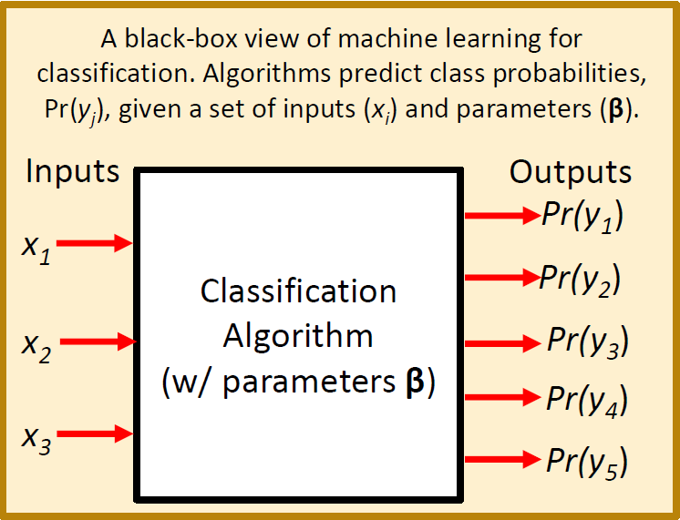
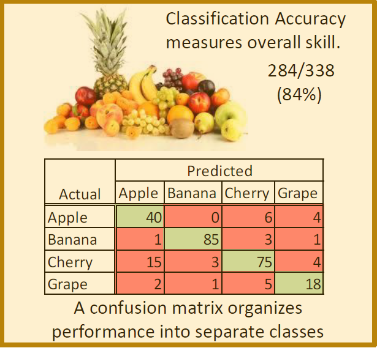
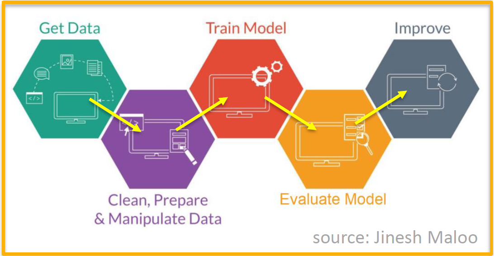
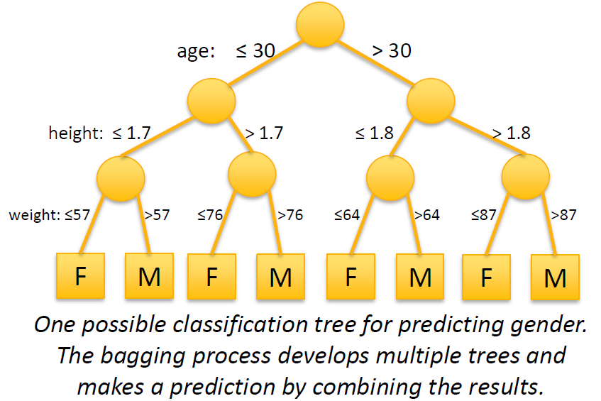
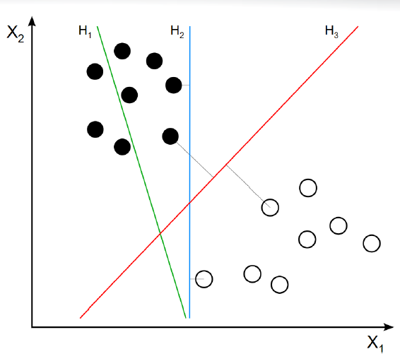
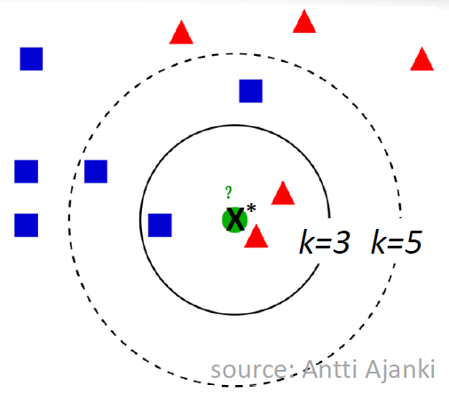
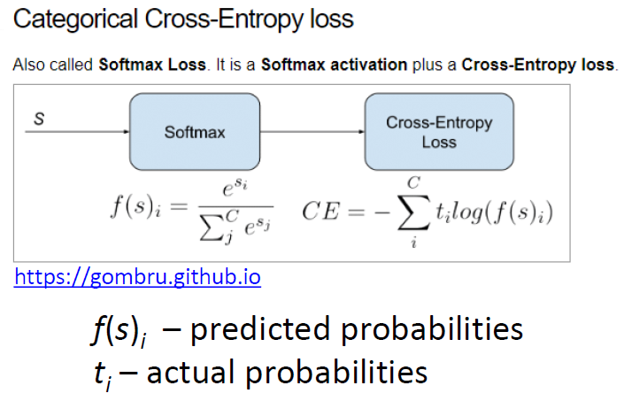

# Machine learning {#four}

This week you will learn about machine learning for classification using _R_. Objectives are:

- To provide an overview of the underlying concepts of machine learning for classification.

- To provide an introduction to some popular classification algorithms.

- To explore these classification algorithms using various packages in _R_.

- To apply various classification algorithms to the statewide COVID-19 dataset.

## Day 22 (Monday) Zoom check-in

Here is an overview of what we'll cover in today's Zoom session:

- Overview of Machine Learning for Classification (30 minutes)

- Introduction to the Random Forest algorithm (5 minutes)

- A Random Forest Example in _R_ using COVID-19 Data (25 minutes)

### A Machine Learning Primer

Machine Learning (ML) may be defined as using computers to make inferences about data.

- A mapping of inputs to outputs, Y = f(<b>X</b> , <b>$\beta$</b>)

<i>ML for Classification</i> refers to algorithms that map inputs to a discrete set of outputs (i.e. classes or categories)

- For example, predicting health risk (mild, moderate, severe) based on patient data (height [m], weight [kg], age [years], smoker [yes/no], etc.)
  
- Or predicting [pandemic severity index][] (PSI) of COVID-19 in a state based on statewide population data.

```{r echo=FALSE}
cats=c(1:5)
frate=c("< 0.1%  ", "0.1% - 0.5%  ", "0.5% - 1.0%  ", "1.0% - 2.0%  ", "> 2.0%  ")
example=c("seasonal flu", "Asian flu", "n/a", "n/a", "Spanish flu")
df = data.frame(PSI=cats, Death.Rate=frate, Example=example)
print(df, row.names = FALSE, right = FALSE)
```

- Predictions are typically expressed as a vector of probabilities.
  
  - e.g. Pr(cancerous) vs. Pr(benign)
    
  - e.g. Pr(PSI=1), Pr(PSI=2), ..., Pr(PSI=5)

#### A "Black Box" View of Machine Learning {-}

The diagram below illustrates the machine learning concept in terms of a "black box" model that converts inputs into predictions.

```{r echo = FALSE, fig.align="center", out.width="50%"}

```

#### A "Black Box" Example {-}

The diagram below illustrates a more concrete machine learning model that converts height, weight, and age into a prediction of whether or not the individual is male or female.

```{r echo = FALSE, fig.align="center", out.width="50%"}
knitr::include_graphics('images/ml_black_box_example.png')
```

#### Some Important Machine Learning Terms {-}

The above example highlights some important machine learning terminology:

- <b>Features</b> (<b>X</b>): Features are the inputs to the model. They are also known as descriptive attributes or explanatory variables. In terms of _R_, a single set of features corresponds to a tuple or row of data and a complete set of feature data maps nicely to a data frame or tibble.

- <b>Parameters</b> (<b>$\beta$</b>): Parameters are internal variables of the selected machine learning algorithm. They are also known as coefficients or training weights. These internal parameters need to be adjusted to minimize the deviation between predictions and observations. The machine learning algorithms and pacakages that we'll be using in _R_ take care of this minimization process for us.

- <b>Labels</b> (<b>Y</b>): Labels are the outputs of the algorithm, corresponding to the categories you are attempting to predict.

- <b>Training Data</b>: Training data is a data set containing paired observations of inputs (i.e features) and outputs (i.e. labels). Training data is also known as measurement data, observation data or calibration data.

- <b>Training</b>: Training is the process of adjusting internal algorithm paramters (<b>$\beta$</b>) to obtain the best possible match between training data and corresponding model predictions. Training is also known as model calibration or parameter estimation.

An example set of training data that could be used in the gender prediction example is given below. The frist three columns contain feature data and the last column contains label data. We could use this data to train a model to predict a person's gender based on their height, weight and age.

```{r echo=FALSE}
h=c(1.69,1.74,1.92,1.80,1.59,1.85,1.75,1.96,1.85,1.78,1.74,1.81,1.73)
w=c(62,76,82,100,47,75,63,83,39,58,70,57,78)
a=c(30,27,25,41,24,26,33,33,32,28,30,26,32)
g=c("male","female","male","male","female","male","female","male","male","female","female","female","male")

df = data.frame(height_m=h,weight_kg=w,age_y=a,gender=g)
print(df, row.names = FALSE, right = FALSE)
```

- <b>Test Data</b>: Like training data, test data is a data set containing paired observations of inputs (i.e features) and outputs (i.e. labels). However, test data is deliberately <i>not included</i> in the training process. Performance measures computed using test data help to quantify the expected performance of the model if/when it is applied to unlabeled data.

Upon completion of training, it is important to evaluate the quality of the model and its skill or ability at making correct predictions. Some terms related to this evaluation process are defined below:

- <b>Classification Accuracy</b>: Classification accuracy is the ratio of correct predictions to the total predictions. Classification accuracy can be computed using the training data set or using the test data set.

- <b>Confusion Matrix</b>: The confusion matrix is a more detailed summary (relative to classification accuracy) of the performance of a classification algorithm. The diagonals of the confusion matrix count how often the algorithm yields the correct classification for each class. The off-diagonal entries count how often the algorithm confuses one class with another.

The figure below illustrates the classification accuracy and confusion matrix for an example that attempts to classify images of fruits.

```{r echo = FALSE, fig.align="center", out.width="50%"}

```

#### The Machine Learning Process {-}

Now that we've defined some of the important machine learning terminology let's take a 30,000 foot view at the overall machine learning process. This is a general description of the process that you can follow each time you build and use a machine learning model. The process is illustrated in the figure below (with credit to [Jinesh Maloo][]):

```{r echo = FALSE, fig.align="center", out.width="75%"}

```

- Step 1: Prepare labeled data for training and validation.

- Step 2: Select a machine learning algorithm (i.e. model).

- Step 3: Train the model.

- Step 4: Evaluate model performance.

- If model is useful:

  - Step 5: Apply to unlabled data.
  
- Else (needs improvement):

  - Collect more data (go back to Step 1).
  
  - Revise model (go back to Step 2)

[pandemic severity index]: https://en.wikipedia.org/wiki/Pandemic_severity_index

[Jinesh Maloo]: https://blog.usejournal.com/machine-learning-for-beginners-from-zero-level-8be5b89bf77c

### The Random Forest Algorithm

The random forest algorithm is a popular choice for machine learning.

- Over 20 _R_ packages have an implementation of some form of the algorithm.

- We'll be using the `randomForest` pacakge.

- The algorithm is like `bagging` (boostrap aggregating) regression trees, but the rgression trees are de-correlated.

The figure below illustrates one possible `tree` in a `random forest` for a gender prediction model. In computer science terminology, each split in the figure is a `branch` of a graph `tree`. In simple terms, the split points are randomly generated and the resulting `trees` combine to form a `random forest`.

```{r echo = FALSE, fig.align="center", out.width="50%"}

```

The figure below illustrates a set of 6 `trees` that make up a `random forest` for predicting housing prices. The image is courtesy [Bradley Boehmke at the University of Cincinnati][]. Examine the figure closely and notice that:

  - The split variables can differ across trees (not all variables are included in all trees).
  
  - The split variables can differ within trees (not all paths consider the same set of variables).
  
  - The order of splits can differ.
  
  - The split values can differ.
  
```{r echo = FALSE, fig.align="center", out.width="100%"}
knitr::include_graphics('images/ml_rf_tree_housing.png')
```

The job of the random forest algorithm is to determine the optimal set of trees for your data set, including the splitting configuration of each tree (i.e. order, values, etc.).

Now you have a basic understanding of machine learning and the random forest algorithm. You're probably excited to get going with applying the algorithm! But first, we need to have a data set to work with. In the next section you'll learn about a data set that can be used for predicting the severity of COVID-19 in a state.

[Bradley Boehmke at the University of Cincinnati]: https://uc-r.github.io/random_forests

<hr>

### A COVID-19 Dataset for Machine Learning

We'd like to predict the severity of COVID-19 in a given state using statewide <i>feature</i> data like population, urban density, number of hospital beds, date of stay at home order, etc. We've already seen that we can get the information about cases and deaths from the New York Times github page. However, gathering corresponding statewide feature data requires quite a bit of hunting through various public websites. Consequently, we're going to skip over the painstaking process of marshalling the feature data and just provide you with a dataset that is already nice and prepped for machine learning.  

You'll work with two `.csv` files - a <b>data</b> file that contains a veriety of statewide data, and a <b>metadata</b> file that describes the various columns of the data file. This combination of data and metadata files is a common way of sharing datasets.

To give you an idea of what was involved in assembling the data and metadata file, a summary of the data collection and processing steps is given below:

- First, a snapshot of the New York Times (NYT) COVID-19 data from April 27th was downloaded from the [nytimes github repo][] and stored on local disk.

```
$ wget https://raw.githubusercontent.com/nytimes/covid-19-data/master/us-counties.csv
$ mv us-counties.csv us-counties_04_27_2020.csv
```

- The NYT COVID-19 data was processed using _R_ : 

  - The cases and deaths in `us-counties_04_27_2020.csv` were aggregated into statewide values.
  
  - The death rate was calculated and categorized according to an 8-point severity index.
  
  - Finally, the statewide data (augmented with death rate and severity index) was exported as a `.csv` file.

```{r eval=FALSE}

# get data from file
covid_data_file <- file.path("./workdir", "us-counties_04_27_2020.csv")

# read in as data frame
us_data <- read.csv(covid_data_file, stringsAsFactors = FALSE)

# aggregate by county and state
cases_county_state <- aggregate( cases ~ county + state, us_data, max )
deaths_county_state <- aggregate( deaths ~ county + state, us_data, max )

# aggregate by state
cases_state <- aggregate(cases ~ state, cases_county_state, sum)
deaths_state <- aggregate(deaths ~ state, deaths_county_state, sum)

# calculate death rate
death_rate_state <- 100.00 * (deaths_state$deaths / cases_state$cases)

# Assign the following severity index using cut:
##  PSI Death.Rate    
##  1   < 0.1%        
##  2   0.1% - 0.5%   
##  3   0.5% - 1.0%   
##  4   1.0% - 2.0%   
##  5   2.0% - 4.0%   
##  6   4.0% - 6.0%   
##  7   6.0% - 8.0%   
##  8   >8.0%         
psi_state <- cut(death_rate_state, 
                 breaks=c(0.0,0.1,0.5,1.0,2.0,4.0,6.0,8.0,100.0),
                 labels=c(1,2,3,4,5,6,7,8))

# combine into new data frame
out_df <- data.frame(
    state=cases_state$state, 
    cases=cases_state$cases, 
    deaths=deaths_state$deaths,
    death_rate=death_rate_state,
    severity_index=psi_state)

# write out as csv
my_out_file <- file.path("./workdir", "covid_data.csv")
write.csv(out_df, file = my_out_file, row.names = FALSE)
```

- The resulting statewide COVID-19 <b>label</b> data (i.e. what we would like to predict) was augmented with 32 statewide <b>features</b>, including population, percent urban, number of hospital beds, etc. Feature data was collected from a veriety of sources, including the Center for Disease Control, the American Heart Association, the U.S. Census Bureau, etc. In some cases the feature data was available for direct download (e.g. as a `.csv` file) and in other cases the feature data was manually harvested (e.g. cut-and-paste from websites).

- The augmented (i.e. features + labels) `.csv` file was split into two `.csv` files that you will need to download:

  - [statewide_covid_19_data_04_27_2020.csv](assets/statewide_covid_19_data_04_27_2020.csv): This file contains the final COVID-19 machine learning data set, but features and labels are coded so that feature columns are named `X01`, `X02`, `X03`, etc. and label colunms are named `Y01`, `Y02`, `Y03`, etc. 

  - [statewide_covid_19_metadata_04_27_2020.csv](assets/statewide_covid_19_metadata_04_27_2020.csv): This file maps the column names in the data file to more meaningful names and desciptions (including units) of the associated variables. For example `X01` is `Pct_Sun` and has a description of `Percent sunny days`. This is known as <b>metadata</b> - data that describes other data.
  
Click on the links above to download the data and metadata files that you'll need for the machine learning examples presented throughout the week.

[nytimes github repo]: https://raw.githubusercontent.com/nytimes/covid-19-data/master/us-counties.csv

<hr>

### A Random Forest Example Using COVID-19 Data

Let's apply the random forest algorithm to the COVID-19 dataset. We'll build out the required _R_ code in sections. To get started, open a new _R_ script in _RStudio_ and name it `covid_19_rf.R`. Enter the code below, but omit lines that begin with a double-hash (`##`) because these are the expected output:

```{r}
#
# Part 1 - load the data
#
library(randomForest)
library(readr)

data_file <- file.path("./assets",
                      "statewide_covid_19_data_04_27_2020.csv")
df <- read_csv(data_file)
# coerce severity to a factor (so RF algorithm uses classification)
df$Y04 <- as.factor(df$Y04)
df

metadata_file <- file.path("./assets",
                          "statewide_covid_19_metadata_04_27_2020.csv")
mdf <- read_csv(metadata_file)
mdf
```

Try to run the code. You may get an error about missing the `randomForest` package. You can install it from the RStudio console (see below) or using the installer in the RStudio `packages` pane.

```{r eval=FALSE}
install.packages("randomForest")
```

Now we've loaded the data and metadata file. Let's pick a subset of 5 of the features and use them to try and predict the pandemic severity index (i.e. `Y04`). Add the `Part 2` code below to your RScript but omit lines that begin with a double-hash (`##`) :

```{r}
#
# Part 2 - select features and label
#
library(dplyr)

# describe all possible features and labels
print(mdf, n = nrow(mdf))

# select some features and the severity index label
my_x <- c("X01","X10","X12","X13","X23")
my_y <- c("Y04")
my_xy <- c(my_x, my_y)

# get descriptions of the selected features and label
filter(mdf, Code %in% my_xy)

# subset the dataframe
rf_df <- select(df, all_of(my_xy))
```

Now we’ll add code to create and train a basic Random Forest model. Add the `Part 3` code below to your RScript but omit lines that begin with a double-hash (`##`) :

```{r}
#
# Part 3 - create and train the model
#
# split into train (75%) and test (25%) datasets
train <- rf_df[seq(1,nrow(rf_df), by = 4),]
train <- rbind(train, rf_df[seq(2,nrow(rf_df), by = 4),])
train <- rbind(train, rf_df[seq(3,nrow(rf_df), by = 4),])
test <- rf_df[seq(4,nrow(rf_df), by = 4),]

# create and train the RF model
model <- randomForest(Y04 ~ X01 + X10 + X12 + X13 + X23, 
                      data = train)

# show results, includes confusion matrix for training data
print(model) 

# measure of parameter importance
importance(model) 
```

At this point the model is trained and the next step is to evaluate its usefulness at making predictions. Let's see how the model does at predicting the labels of the test dataset. Remember that the test data was <i>not</i> used during the training exericse. As such, the confusion matrix and classification accuracy associated with the test dataset provides a useful check of the skill of the model. Add the `Part 4` code below to your RScript but omit lines that begin with a double-hash (`##`) :

```{r}
#
# Part 4 - evaluate the model using test data
#

# extract test predictions
preds <- predict(model, test)

# confusion matrix
actual <- factor(test$Y04)
predicted <- factor(preds)
common_levels <- sort(unique(c(levels(actual), levels(predicted))))
actual <- factor(actual, levels = common_levels)
predicted <- factor(predicted, levels = common_levels)
confusion <- table(actual,predicted)
print(confusion)

#classification accuracy
accuracy <- sum(diag(confusion)/nrow(test))
cat("Classification Accuracy = ", accuracy, "\n")
```

Save your script and run it. Take a look at the results for the test dataset - the classifcation accuracy is well under 50%. Furthermore, there are systematic failures in the confusion matrix. It's not a very good model. The most likely culprit is that the set of features is inadequate for making the desired prediction. We should re-run the model using different or additional features.

## Day 23 - Support Vector Machines

For today's independent work you will learn about the Support Support Vector Machine (SVM) algorithm and apply it to the COVID-19 data that you worked with on Monday.

The SVM algorithm seeks to determine an optimal hyperplane that separates labeled observations.

- Hyperplanes can be linear or non-linear.

- Support vectors are data points lying closest to the optimal hyperplane.

- The `e1071` package in R provides an implementation of SVM.

The figure below illusrates a linear SVM. Line $H_3$ provides the optimal separation between the white and black data points. Points with perpendiculars to $H_3$ are the support vectors for the dataset. The SVM algorithm classifies unlabeled data points by examining their location with respect to the optimal hyperplane. Data points <i>above</i> line $H_3$ would be classified as "black" and datapoints <i>below</i> the line would be calssified as white.

```{r echo = FALSE, fig.align="center", out.width="50%"}

```

### An SVM Example using COVID-19

We've already laid a large part of the groundwork for machine learning with the random forest example. With a few modifications, the `covid_19_rf.R` script can be adapted to use an SVM algorithm instead of Random Forest.

- Open your `covid_19_rf.R` script in _RStudio_

- Click `File --> Save As ...` and name the file `covid_19_svm.R`

- In `Part 1` of `covid_19_svm.R`, replace `library(randomForest)` with `library(e1071)`. This will load the `svm` algorithm instead of the `randomForest` algorithm.

- In `Part 3` of the code, replace `randomForest()` with `svm()` and add the following argument to the `svm()` function: `probability = TRUE`. The `svm()` code should look something like this:

```{r eval=FALSE}
model <- svm(Y04 ~ X01 + X10 + X12 + X13 + X23, 
             data = train,
             probability = TRUE)
```

- The `svm()` package does not provide useful implementations of `print(model)` or `importance(model)`. Comment out, or delete, those lines of `Part 3` and replace with `summary(model)`. When you are finished, the final section of the `Part 3` code should look something like this:

```{r eval = FALSE}
# show results, includes confusion matrix for training data
# print(model) 
#
# measure of parameter importance
# importance(model) 
#
# summarize the trained SVM
summary(model)
```

That's it! The rest of the code (i.e. `Part 4`) can be re-used. Save your `covid_19_svm.R` script and run it. How does the SVM algorithm perform in comparison with the Random Forest algorithm?

## Day 24 - the $k$-Nearest Neighbors Algorithm

For today's independent work you will learn about the $k$-Nearest neighbors (KNN) algorithm and apply it to the COVID-19 data.

For a given unlabeled data point ($X^*$) the KNN algorithm identifies the nearest $k$ labeled data points.

- Euclidean distance is typical

- <i>Normalization of data is necessary to prevent biased distances.</i>

- The label of $X^*$ is predicted to be the most frequently occurring label among the $k$ nearest neighbors.

- The `class` package in R provides an implementation of KNN.

The figure below illustrates the KNN approach and is courtesy of [Antti Ajanki][]. For $k=3$, the neighborhood contains 2 triangles and 1 square so we’d predict $X^*$ is a triangle. For $k=5$, the neighborhood contains 3 squares and 2 triangles so we’d predict $X^*$ is a square.

```{r echo = FALSE, fig.align="center", out.width="50%"}

```

With a few modifications, the `covid_19_svm.R` script can be adapted to use an KNN algorithm instead of SVM.

- Open your `covid_19_svm.R` script in _RStudio_

- Click `File --> Save As ...` and name the file `covid_19_knn.R`

- In `Part 1` of `covid_19_knn.R`, replace `library(e1071)` with `library(class)`. This will load the `knn` algorithm instead of the `svm` algorithm.

- The KNN algorithm requires the feature data to be normalized. Add the following line in `Part 1` of `covid_19_knn.R`. Add the line in between the `df$Y04 <- as.factor(df$Y04)` line and the `df` line. If necessary, use `install.packages('BBmisc') ` to install the `BBmisc` package and its `normalize()` function.

```{r eval=FALSE}
df$Y04 <- as.factor(df$Y04)
df <- BBmisc::normalize(df, method = "range") # add this line
df
```

- In `Part 3` of the code, replace `svm()` with `knn()` and adjust the call to `knn()` so that it looks like this:

```{r eval=FALSE}
model <- knn(select(train, all_of(my_x)),
             select(test, all_of(my_x)),
             train$Y04,
             k = 7,
             prob = TRUE)
```

- The `knn()` package does not provide useful implementations `print(model)`, `importance(model)`, or `summary(model)`. Comment out, or delete, those lines of `Part 3`. When you are finished, the final section of the `Part 3` code should look something like this:

```{r eval = FALSE}
# show results, includes confusion matrix for training data
# print(model) 
#
# measure of parameter importance
# importance(model) 
#
# summarize the trained SVM
# summary(model)
```

- In `Part 4` of the script, replace:

```{r eval=FALSE}
preds <- predict(model, test)
```

with:

```{r eval=FALSE}
preds <- as.data.frame(model)[,1]
```

That's it! The rest of the code can be re-used. Save your `covid_19_knn.R` script and run it. How does the KNN algorithm perform in comparison with the Random Forest and SVM algorithms?

[Antti Ajanki]: https://commons.wikimedia.org/wiki/File:KnnClassification.svg

## Day 25 - Artificial Neural Networks

For today's independent work you will learn about artificial neural networks (ANN). You will attempt to add Keras and TensorFlow support to your R/RStudio installation. If this is successful, you can apply an ANN to the COVID-19 example that you've been working with during the week.  

### Introduction to Artifical Neural Networks

Artificial Neural Networks (ANN) are made of an input layer, an output layer, and one or more “hidden”
layers. A simple "shallow" ANN is illustrated in the following figure:

```{r echo = FALSE, fig.align="center", out.width="50%"}
knitr::include_graphics('images/ml_ann_shallow.png')
```

The figure highlights some interesting ANN features:

- Each layer contains one or more neurons and these are represented as circles in the figure.

- The first layer is call the <i>input</i> layer and the number of neurons in this layer is matched to the number of features in the data set.

- The last layer is called the <i>output</i> layer. The number of neurons in the output layer is equal to the number of categories that the ANN is trying to predict. For example, there would be 2 neurons in the output layer if you were trying to predict gender (male vs. female). The output of each neuron in the output layer represents the probability or likelihood of a given category (e.g. Pr(male) vs. Pr(female)).

- Intermediate layers are called <i>hidden</i> layers. Hidden layers can have more or less neurons than the input and output layers.

- Each neuron produces a weighted combination of its inputs and passes the results to neurons in the next layer.

- Weights ($w_i$) are adjusted to develop an optimal mapping between inputs ($x_i$) and outputs ($y_i$).

#### Deep Neural Networks {-}

The advent of faster processors and accelerators like [NVIDIA's GPUs][] and [Google's TPUs][] has made it possible to construct and train ANNs that have more and more hidden layers. Such networks are often referred to as "deep neural networks". The corresponding modeling process has been dubbed "deep learning" to distinguish it from conventional machine learning approaches like random forests, support vector machines, and k-Nearest neighbors.

The figure below illustrates a "fully connected" (i.e. all neurons in adjacent layers are connected) deep neural network.

```{r echo = FALSE, fig.align="center", out.width="50%"}
knitr::include_graphics('images/ml_ann_deep.png')
```

- The increased number of layers yields an extremely large number of connections.

- More connections allows the neural network to consider massive numbers of input combinations.

- More combinations means more weights that need to be trained. 

- Calibrating so many weights requires an increasingly large training data set.

Nowadays, the biggest challenge for applying deep learning is not computational resources but rather data scarcity.

[NVIDIA's GPUs]: https://www.nvidia.com/en-us/deep-learning-ai/developer/

[Google's TPUs]: https://cloud.google.com/blog/products/ai-machine-learning/what-makes-tpus-fine-tuned-for-deep-learning

### Keras and TensorFlow

TensorFlow is a very popular set of deep learning tools that was developed by Google and made Open Source in 2015. TensorFlow is capable of exploiting GPU acceleration and can solve a wide variety of complex ANNs. The figure below illustrates the various layers of TensorFlow.

- At the lowest level is the kernel. The kernel is responsible for solving an ANN in the most efficient manner using all of the resources (e.g. CPUs, GPUS, TPUs, etc.) that a given TensorFlow installation has at its disposal.

- The remaining layers consist of various programming interfaces. We'll actually be using an interface called Keras.

- The "native" programming language for TensorFlow is Python version 3.x and TensorFlow is conveniently deployed via the Anaconda Python distribution. So you will need to install Anaconda Python as a pre-requisite for using TensorFlow - details are provided below.

```{r echo = FALSE, fig.align="center", out.width="50%"}

```

Keras is an application programming interface (API) for TensorFlow. Keras is now bundled with TensorFlow - so Keras will be installed automatically if/when you install TensorFlow. 

Keras makes it easier to assemble and train complicated train complicated neural networks. Examples include: convolutional neural networks, recurrent neural networks, generative adversarial neural networks, and autoencoders. With Keras you can:

- Easily translate complex multi-layered ANN diagrams into the corresponding Keras code.

- Select loss functions and optimizers from a large built-in library.

- Include a variety of pre-defined [layer types][], including:

  - dense (i.e. fully connected) layers
  
  - embedding, pooling and dropout layers
  
  - cropping, padding and flattening layers
  
  - 1D/2D/3D convolutional layers
  
  - long short term memory (LSTM) layers
  
  - many more!
  
[layer types]: https://keras.io/layers/core/
   
#### Installing Keras and TensorFlow {-}

A pre-requisite for using Keras and TensorFlow is to install Anaconda Python version 3.x: https://www.anaconda.com/download

Instructions for installing Keras and TensorFlow for use within RStudio are provided at https://keras.rstudio.com/ and these are repeated below. The installation of Anaconda Python and Keras can take a while and may require restarting _RStudio_. It is a good idea to save and close any open _RStudio_ sessions before attempting these installations.

<b>Option #1</b> (suggested by https://keras.rstudio.com )

```{r eval=FALSE}
install.packages("devtools")
devtools::install_github("rstudio/keras")
library(keras)
install_keras()
```

<b>Option #2</b> (if option #1 fails)

- Step 1: Use `conda` to install TensorFlow (and Keras, too) from a system prompt (e.g. `DOS` on Windows machines). On Windows, you may need to choose "run as admin" when launching the `DOS` prompt.

```
[DOS]> activate r-reticulate
(r-reticulate)[DOS]> conda remove  tensorflow
(r-reticulate)[DOS]> conda install tensorflow
```

- Step 2: Use the short form package installations in _RStudio_ (i.e. skip `install_keras()` and `install_tensorflow()`):

```{r eval=FALSE}
# re-install tensorflow
install.packages("tensorflow")

# check tensorflow installation
library(tensorflow)
Sys.setenv(HDF5_DISABLE_VERSION_CHECK = "2")
tf$constant("Hello from Tensorflow")

# re-install keras
devtools::install_github("rstudio/keras")

# check keras installation
library(keras)
to_categorical(c(0:4),5)
```

### Applying Keras and TensorFlow to the COVID-19 Dataset

Give yourself a big pat on the back if you've successfully completed the Keras installation! If you run into trouble please post on the Teams chat and hopefully someone can help you out.

To apply Keras to the COVID-19 dataset, we'll adapt a copy of the `covid_19_knn.R` script. 

- In _RStudio_, open `covid_19_knn.R` and save it as `covid_19_keras.R`

- In `Part 1` of the `covid_19_keras.R` file, replace `library(class)` with `library(keras)`. This will adjust the script to use the Keras API instead of the KNN algorithm.

- In `Part 3` of the script, insert the following code in between the sections that split the data and create the model. 
  
```{r eval=FALSE}

# split into train (75%) and test (25%) datasets
# .
# .
# .

# ----- insert the following code -----
# manipulate dataset into Keras format
x_train <- as.matrix(select(train, all_of(my_x)))
y_train <- sapply(select(train, all_of(my_y)), as.character)
y_train <- as.integer(y_train)

x_test  <- as.matrix(select(test, all_of(my_x)))
y_test  <- sapply(select(test, all_of(my_y)), as.character)
y_test  <- as.integer(y_test)

y_min   <- min(y_train,y_test)
y_train <- y_train - y_min
y_test  <- y_test  - y_min

# one-hot encoding
n_classes <- length(levels(df$Y04))
y_train <- to_categorical(y_train, n_classes)
y_test  <- to_categorical(y_test, n_classes)

# assign hyperparameters
num_epochs <- 200
num_batch <- 25
val_split <- 0.2

# ----- end of code instertion -----            

# create and train the KNN model
# .
# .
# .
```

The previous bit of code prepares the data set for use by Keras:

  - Keras wants <b>X</b> (features) and <b>Y</b> (labels) separated.
  
  - Keras wants features represented as matrices.
  
  - Keras wants labels represented as 0-based integers that are "one-hot" encoded. The figure below illustrates integer and one-hot encoding of a set of animal categories. In the figure, `Pr()` represents the probability of a given category.

```{r echo = FALSE, fig.align="center", out.width="50%"}
knitr::include_graphics('images/ml_one_hot_encoding.png')
```

The code segment given above also sets up some algorithm parameters for the ANN:

- `num_epochs`: The number of training steps. At each training step, an optimizer refines the network weights to improve predictions associated with a randomly sampled subset (i.e. batch) of the training data.

- `num_batch`: The size of the randomly sampled subset of the training data that is used in each training epoch.

- `val_split`" The validation split is a float between 0 and 1. It is the fraction of the training data to be used as validation data. The model will set apart this fraction of the training data (i.e. it will not train on it). The model will evaluate the loss and other metrics on this data at the end of each epoch.

The next step in adapting the KNN example to use Keras is to replace the "create and train" portion. 

Replace:

```{r eval=FALSE}
# create and train the KNN model
model <- knn(select(train, all_of(my_x)),
             select(test, all_of(my_x)),
             train$Y04,
             k = 7,
             prob = TRUE)
```

With:

```{r eval=FALSE}
model <- keras_model_sequential()
n_inputs <- ncol(x_train)
# input layer
layer_dense(model, units = 20, activation = 'relu', input_shape = c(n_inputs))
# hidden layer
layer_dense(model, units = 10, activation = 'relu')
# output layer
layer_dense(model, units = n_classes, activation = 'softmax')
# display nework architecture
summary(model)
# assign loss function and optimizer
compile(model, 
        loss = "categorical_crossentropy",
        optimizer = optimizer_rmsprop(),
        metrics = c('accuracy'))
# train the model
results <- fit(model,
               x_train, y_train,
               epochs = num_epochs,
               batch_size = num_batch,
               validation_split = val_split)
# examine convergence progress
plot(results)
results
```

This is a simple fully-connected shallow neural network. It is configured to use "categorical cross-entropy" as the loss function. The loss function is a measure of how closely the model outputs match with the actual labels in the training data. The figure below illustrates the steps involved in calculating the loss function. The `optimizer` field specifies an algorithm for minimizing the loss function. The `rmsprop` optimizer is an implementation of the "<u>R</u>oot <u>M</u>ean <u>S</u>quared <u>prop</u>agation" method. It is a fast and effective gradient-based procedure that is a good default choice for classification problems.

```{r echo = FALSE, fig.align="center", out.width="75%"}

```

Make sure your plot window has some room; then highlight the portion of ANN script that you've adapted so far and run it. You should eventually see pair of plots similar to the figure below. These plots provide an epoch-by-epoch trace of the accuracy and loss for both the training and validation data. Watch out for cases of "overfitting" - where the training performance improves but the validation performance degrades.

```{r echo = FALSE, fig.align="center", out.width="100%"}
knitr::include_graphics('images/Rplot_ann_convergence.png')
```

The final step in modifying the KNN script for use with Keras is the computation of the classification accuracy and confusion matrix (i.e `Part 4`). Only the the `preds` assignment needs to be changed:

Replace:

```{r eval = FALSE}
preds <- as.data.frame(model)[,1]
```

With:

```{r eval = FALSE}
preds <- predict_classes(model, x_test) + y_min
```

Highlight and run the `Part 4` code to check the skill of the model at predicting the test data. How do the results compare to the random forest, support vector machine, and k-nearest neighbors algorithms?

## Day 26 (Friday) Zoom check-in

Today we'll check how you're doing with using machine learning in _R_. Then we'll get you prepared for weekend activities, where you'll continue to explore modeling using the COVID-19 dataset. 

### Review and trouble shoot (25 minutes)

- Has everyone had a chance to try out at least one of the machine learning algorithms?

- Has anyone tried additional or alternative combinations of features?

- What is the best classification accuracy that you have been able to obtain?

- What parameters appear to be the most important?

- Has anyone attempted the Keras/TensorFlow example? How did that go?

### This weekend (25 minutes)

#### ROC/AUC - Another Measure of Machine Learning Performance {-}

We've already seen how classification accuracy and the confusion matrix give an indication of the performance of a trained machine learning algorithm. It's also good practice to examine the "ROC curve" and related "AUC" metrics. 

- <b> ROC curve</b>: As illustrated in the figure below, the ROC (Receiver Operating Characteristic) curve plots the true positive (TP) vs. false positive (FP) rate at various probability thresholds. In the figure, the dashed blue line represents a hypothetical ROC curve for some machine learning model and the solid red line is the curve for a "non-informative" model (i.e. a model that makes a uniform random guess). As such, we'd like the blue curve to be as far above the red curve as possible.

```{r echo = FALSE, fig.align="center", , out.width="75%"}
knitr::include_graphics('images/ml_roc_curve_example.png')
```

- <b>AUC</b>: AUC stands for "area under curve" and is the area under the ROC curve. In the previous figure, the AUC would be the area under the dashed blue curve. Values of AUC quantify the degree to which an ROC curve lies above (or below) the "non-informative" curve. Some interesting AUC values:

  - AUC = 0.0: the model is always wrong (with respect to TP vs. FP)
  
  - AUC = 0.5: the model is no better than guessing (i.e. the model matches the red "non-informative" curve in the figure)
  
  - AUC = 1.0: the model is always right (with respect to TP vs. FP)

For a problem with multiple classes (as opposed to a binary True/False, Male/Female, or Yes/No problem) we can compute the ROC curve curve and AUC measures using a “one vs. all” approach:

- First, extract predicted probabilities from the RF model (the scores).

- Next, extract actual classification for each category.

- Finally, leverage three commands of the `ROCR` module:

  - `prediction()`: retrieve scores

  - `performance()`: generates TPR, FPR, and AUC measures through two separate calls
  
  - `print()`: generates a TPR vs. FPR plot

The ROC/AUC calculation is fairly involved so we'll create a helper function for it and then incorporate the helper function into our machine learning scripts.

```{r}
#
# Part 5 - ROC/AUC
#

# roc_one_vs_all()
#   A helper function to compute one vs. all ROC/AUC for a given level (i)
roc_one_vs_all <- function(i) {
    if(is.na(sum(probs))){
        return(NA)
    }
    
    actual <- as.numeric(y_test[[1]] == i)
    score <- probs[,i]
    
    pred <- ROCR::prediction(score, actual)
    perf <- ROCR::performance(pred, "tpr", "fpr")
    
    ROCR::plot(perf, 
         main="ROC Curve", 
         col=cols[as.numeric(i)], 
         add = i != lvls[[1]])
    
    # calculate the AUC and print
    auc_i <- ROCR::performance(pred, measure="auc")
    as.numeric(auc_i@y.values)
}

# prepare data for computing ROC/AUC
x_test <- select(test, all_of(my_x))
y_test <- select(test, all_of(my_y))
# how we obtain probs depends on the algorithm
if (inherits(model, "randomForest")) 
{
    probs <- predict(model, x_test, type='prob')
} else if (inherits(model, "svm"))
{
    probs <- predict(model, x_test, probability = TRUE)
    probs <- attributes(probs)
    probs <- as.data.frame(probs$probabilities)
    probs <- probs[,order(colnames(probs))]
} else if (inherits(model,"keras.engine.sequential.Sequential"))
{
    x_test <- as.matrix(select(test, all_of(my_x)))
    probs <- as.data.frame(predict(model, x_test))
    colnames(probs) <- levels(df$Y04)
} else # the KNN alg requires approximation of probabilities
{
  # highest predicted probabilities
  pnrst <- attributes(model)$prob
  # corresponding one-based categories
  y_one <- as.numeric(min(levels(df$Y04))) - 1
  vpreds <- as.integer(as.character(preds)) - y_one
  # map probabilities into a matrix of zeroes
  probs <- matrix(0.00, 
                  nrow = length(pnrst),
                  ncol = length(levels(df$Y04)))
  probs[cbind(seq_along(vpreds), vpreds)] <- pnrst
  # coerce to data frame
  probs <- data.frame(probs)
  colnames(probs) <- levels(df$Y04)
}
lvls <- unique(as.character(y_test[[1]]))
cols <- c("red","orange","yellow","green",
          "blue","purple","violet","black")

# vapply helper function across levels
auc <- vapply(lvls, roc_one_vs_all, numeric(1))

# tack on legend and non-informative line
legend("bottomright",
       legend=paste("PSI =",lvls), 
       col=cols[as.numeric(lvls)], 
       lty=1, 
       cex=1.0)
lines(x=c(0,1),
      y=c(0,1),
      lty=2)

# display AUC metrics
print(tibble(lvls, auc))
```

Assuming you've been following along with the daily activities, you can add this `Part 5` code to any of your algorithm scripts (e.g. `covid_19_rf.R`, `covid_19_knn.R`, `covid_19_svm.R`, etc.).  The code uses the `inherits()` function to adapt the output of each individual algorithm into a form that is suitable for the ROC/AUC calculation.

## Day 27

Today you'll explore different combinations of features in your COVID-19 model. 

- Select another 5 features and adjust `Part 2` and `Part 3` of your `covid_19_rf.R` script. In `Part 2` you'll need to adjust the `my_x` variable and in `Part 3` you'll need to adjust the model formula (e.g. `Y04 ~ X01 + ....`). Re-run the script and record the error rate, confusion matrix, and measures of parameter importance.

- Repeat the above step after adding an additional 5 features.

- How does the performance of the model change as more features are included? 

- Does any particular parameter stand out in terms of importance? 

- What does the most important parameter correspond to in termo of the metadata?

## Day 28

Today you'll explore making some tweaks to the random forest model to see if you can improve its performance on the COVID-19 dataset. The algorithm parameters that you'll be adjusting are described below:

- `ntree` : The number of trees to grow. Default is 500.

- `mtry` : The number of variables randomly sampled as candidates at each split. Default is `sqrt(p)` where `p` is the number of features included in the model.

Let's perform some numerical experiments to explore how these algorithm parameters effect model performance:

- Setup a random forest model that has at least 16 features (see instructions from yesterday's activity). 

- In `Part 3` of your `covid_19_rf.R` script, add the following arguments to the `randomForest()` function:

  - `ntree = 1000`

  - `mtry = 8`

- Re-run the script and record the error rate, confusion matrix, and measures of parameter importance.

- Repeat the above process using:

  - `ntree = 2000`
  
  - `mtry = 2`

- Does adjusting the parameters effect the model performance? If so, what observations can you make?

- Can you think of a "better" way to evaluate the influence of algorithm parameters?

Congratulations - you made it through a week of machine learning boot camp! You can download completed scripts (i.e. `Part 1` through `Part 5`) for each algorithm using the links below:

- [Complete Random Forest Example](assets/covid_19_rf.R)

- [Complete Support Vector Machine Example](assets/covid_19_svm.R)

- [Complete $k$-Nearest Neighbors Example](assets/covid_19_knn.R)

- [Complete Keras Example](assets/covid_19_keras.R)

