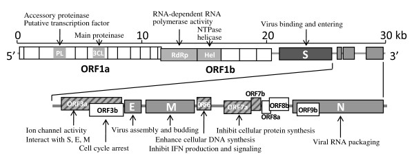

# Bioinformatics with [Bioconductor][] {#five}

[Bioconductor]: https://bioconductor.org

```{r, echo = FALSE, eval = FALSE}
knitr::opts_chunk$set(cache = TRUE)
```

## Day 29 (Monday) Zoom check-in

### Review and trouble shoot

### [Bioconductor][], packages, and biological data

[Bioconductor][]

- Repository of more than 1900 packages for the 'analysis and comprehension of high throughput genomic data'

- Bulk and single cell RNASeq; ChIP and other gene regulation, called variants, flow cytometery, proteomics, ...

- Package discovery using [biocViews][] and [workflows][]

- Landing pages & vignettes

Packages

- One-time installation of [BiocManager][]

    ```{r, message = FALSE}
    if (!requireNamespace("BiocManager"))
        install.packages("BiocManager", repos = "https://cran.r-project.org")
    ```

- Install _Bioconductor_ or _CRAN_ packages

    ```{r, eval = FALSE}
    ## Biostrings and genbankr are Bioconductor packages, rentrez is from CRAN
    BiocManager::install(c("Biostrings", "rentrez"))
    ```

- Validate installation

    ```{r}
    BiocManager::version() # current release is 3.11; needs R 4.0
    BiocManager::valid()
    ```

- Types of packages

    - Software (e.g., [Biostrings][], [SingleCellExperiment][])
    - Annotation (e.g., [org.Hs.eg.db][], [TxDb.Hsapiens.UCSC.hg38.knownGene][], [GO.db][])
    - Experiment data (e.g., [airway][], [scRNAseq][])

[biocViews]: https://bioconductor.org/packages
[workflows]: https://bioconductor.org/packages/release/BiocViews.html#___Workflow
[BiocManager]: https://cran.r-project.org/package=BiocManager
[Biostrings]: https://bioconductor.org/packages/Biostrings
[GenomicRanges]: https://bioconductor.org/packages/GenomicRanges
[SummarizedExperiment]: https://bioconductor.org/packages/Summarizedexperiment
[SingleCellExperiment]: https://bioconductor.org/packages/SingleCellExperiment
[org.Hs.eg.db]: https://bioconductor.org/packages/org.Hs.eg.db
[TxDb.Hsapiens.UCSC.hg38.knownGene]: https://bioconductor.org/packages/TxDb.Hsapiens.UCSC.hg38.knownGene
[GO.db]: https://bioconductor.org/packages/GO.db
[airway]: https://bioconductor.org/packages/airway
[scRNAseq]: https://bioconductor.org/packages/scRNAseq

Key packages

- [Biostrings][] for representing sequence data
- [GenomicRanges][] for working with genomic coordinates
- [SummarizedExperiment][] and [SingleCellExperiment][] for representing experimental summaries, e.g., a gene x sample matrix of RNA-seq expression values.

'Class' and 'method'

- Classes represent data in ways that allow the specialized nature of the data to be exploited, e.g., it makes sense to calculate the `reverseComplement()` of a DNA sequence, but not of an arbitrary character vector.

    ```{r, message = FALSE}
    library(Biostrings)
    sequences <- c(
        chr1 = "CTGACT",
        chr2 = "CTGGGAACT"
    )
    dna <- DNAStringSet(sequences)
    dna

    ## fails! `T` not in the RNA alphabet
    result <- try( RNAStringSet(sequences) )
    ```

- Methods represent the implementation of common ('generic') operations, specialized to the specific classes that the method operates on.

    ```{r}
    length(dna)
    reverseComplement(dna)
    translate(dna)
    ```

    - E.g., one could `translate()` both a DNA sequence, and an RNA sequence, so there is both `translate,DNAStringSet-method` and `translate,RNAStringSet-method`

- Not all operations are implemented as methods on a class

    - E.g., `length()` is a concept shared by collections of DNA and RNA sequences, so the method is defined on a common 'parent' class

    - E.g., `dim()` of a two-dimensional object is sufficient to implement `nrow()` (as `dim()[1]`) and `ncol()` (as `dim()[2]`) so one could use a 'plain old' function `nrow <- function(x) dim(x)[1]` for `nrow()` / `ncol()`, relying on a `dim()` generic and methods to provide specialized behavior.

Getting help

- Vignettes, e.g., [DESeq2 vignette][]! `browseVignettes(package = "DESeq2")`
- Help pages for classes, e.g., `?DNAStringSet`, `?GRanges`
- Discovering methods

    ```{r, eval = FALSE}
    methods("reverse")
    methods(class = "DNAStringSet")
    ```

- Looking at symbols made available by packages (after the package is attached to the `search()` path): `ls("package:GenomicRanges")`

[DESeq2 vignette]:

### This week: SARS-CoV-2 sequence and human tissue-specific gene expression data

Biological background

- RNA virus ([source][img-src-05-1], license: [CC BY-SA 4.0][])

    ```{r echo = FALSE, out.width = "60%"}
    knitr::include_graphics('images/512px-Coronavirus_virion_structure.svg.png')
    ```

- Key domains ([source][img-src-05-2], license: [CC BY 2][])

    ```{r echo = FALSE, out.width = "100%"}
    
    ```

[img-src-05-1]: https://en.wikipedia.org/wiki/File:Coronavirus_virion_structure.svg
[img-src-05-2]: https://en.wikipedia.org/wiki/File:SARS-CoV_genome_organization.jpg

[CC BY-SA 4.0]: https://creativecommons.org/licenses/by-sa/4.0/deed.en
[CC BY 2]: https://creativecommons.org/licenses/by/2.0/deed.en

Setup

- Some essential _Bioconductor_ data structures

    ```{r, message = FALSE}
    library(Biostrings)
    library(GenomicRanges)
    ```

- Additional software

    ```{r, message = FALSE}
    library(rentrez)
    library(genbankr)
    library(DECIPHER)
    library(ggtree)
    ```

- Need to install software?

  - Install [BiocManager][]

    ```{r}
    if (!requireNamespace("BiocManager"))
        install.packages("BiocManager", repos = "https://cran.r-project.org")
    ```

  - Install other _CRAN_ or _Bioconductor_ packges

    ```{r, eval = FALSE}
    pkgs <- c(
        ## packages needing installation, e.g.,
        "Biostrings", "GenomicRanges", "genbankr", "rentrez", "DECIPHER",
        "ggtree"
    )
    BiocManager::install(pkgs)
    BiocManager::valid()
    ```

[Biostrings][] and [GenomicRanges][]

- [Biostrings][]: representing DNA sequences

    ```{r}
    sequences <- c(
        chr1 = "CTGACT",
        chr2 = "CTGGGAACT"
    )
    dna <- DNAStringSet(sequences)
    dna
    ```

- [GenomicRanges][]: annotations in genome space, e.g., create a variable representing 'regions of interest'

    ```{r}
    regions_of_interest <- c(
        "chr1:1-3",
        "chr1:3-6",
        "chr2:4-6"
    )
    roi <- GRanges(regions_of_interest)
    roi
    ```

- Many fun operations, e.g., extract sequences of regions of interest

    ```{r}
    getSeq(dna, roi)
    ```

Sequences and annotations

- Input FASTA files from New York State samples (it makes little biological sense to use just New York samples, but we'll do it anyway!)  to `DNAStringSet`

- Work the Genbank accession of the reference sequence

    - DNA sequence
    - Coding sequence annotations
    - Coding sequences

Alignment and visualization

- Multiple alignment using [DECIPHER][]
- Visualization using [ggtree][]

Gene expression

- Retrieving example data from ExperimentHub
- Annotating cell types

[DECIPHER]: https://bioconductor.org/packages/DECIPHER
[ggtree]: https://bioconductor.org/packages/ggtree

## Day 30 DNA sequences and annotations

### Setup

Set up a directory for working

```{r}
workdir <- "workdir"
if (!dir.exists(workdir))
    dir.create(workdir)
```

Make sure the following packages are installed

```{r, message = FALSE}
library(Biostrings)
library(GenomicRanges)
library(rentrez)
library(genbankr)
```

- Install necessary packages, if needed

    ```{r, eval = FALSE}
    if (!requireNamespace("BiocManager"))
        install.packages("BiocManager", repos = "https://cran.r-project.org")

    ## for example...
    pkgs <- c("Biostrings", "GenomicRanges", "rentrez", "genbankr")
    BiocManager::install(pkgs)
    ```

### Representing DNA sequences

Sample information

- Visit the [NCBI SARS-CoV-2][] site for orientation. We'll retrieve and analyse some of the samples sequenced in New York state

- Read a csv file summarizing records available from the US NCBI.

    ```{r}
    url <- "https://raw.githubusercontent.com/mtmorgan/QuaRantine/master/assets/05-genbank-accessions.csv"
    csv_file <- file.path(workdir, basename(url))
    if ( !file.exists(csv_file) )
        download.file(url, csv_file)

    records <- readr::read_csv(csv_file)
    records
    ```

[NCBI SARS-CoV-2]: https://www.ncbi.nlm.nih.gov/projects/genome/sars-cov-2-seqs

FASTA sequence files

- Download a FASTA file containing DNA sequences of all samples sequenced in New York State (this doesn't make much sense biologically!)

    ```{r}
    url <- "https://raw.githubusercontent.com/mtmorgan/QuaRantine/master/assets/05-SARS-CoV2-NY.fasta"
    fasta_file <- file.path(workdir, basename(url))
    if ( !file.exists(fasta_file) )
        download.file(url, fasta_file)
    ```

- This is a plain text file with a simple format. Each DNA sequence is on a line starting with an identifier, `>MT...`, and then lines representing the DNA (or RNA or amino acid) sequence.

    ```{r}
    readLines(fasta_file, 5)
    ```

- Load the [Biostrings][] package

    ```{r, message = FALSE}
    library(Biostrings)
    options(Biostrings.coloring = FALSE)
    ```

- Read the DNA sequences and explore basic properties

    ```{r}
    dna <- readDNAStringSet(fasta_file)
    dna
    ```

- Perform simple manipulations

    ```{r}
    ## how many records?
    length(dna)

    ## subset
    dna[1:3]
    dna[c('MT434817', 'MT434815')]

    ## extract
    dna[[1]]

    ## number of characters in each record
    head(nchar(dna))
    hist(nchar(dna)) # histogram of sequence lengths
    ```

### Working with `GenBankRecord` objects

Data is often represented in complicated formats that do not fit into the tidy 'table' format of a CSV file. An example is the information displayed on the [SARS-CoV-2 reference genome][] web page.

[SARS-CoV-2 reference genome]: https://www.ncbi.nlm.nih.gov/nuccore/NC_045512

Often 'someone' has written software to manipulate this data in a more convient way.

- Attach the [rentrez][] package, which provides a way to query the NCBI's 'Entrez' collection of data bases. Use `BiocManager::install('rentrez')` if you need to install the package

    ```{r, message = FALSE}
    library(rentrez)

    ## who's responsible?
    maintainer("rentrez")

    ## how to cite?
    citation("rentrez")
    ```

- The accession number for the SARS-CoV-2 reference sequence is `NC_045512`. Use `entrez_search()` to search the NCBI 'nuccore' database to discover information about this accession.

    ```{r}
    accession <- "NC_045512"
    nuccore_record <- entrez_search("nuccore", accession)
    id <- nuccore_record$ids
    id
    ```

- The `id` is an identifier that can be used to actually retrieve the genbank record

    ```{r}
    gb_record <-
        entrez_fetch("nuccore", id, rettype = "gbwithparts", retmode = "text")
    ```

- The record contains all the text in the record; if you like visualize it with

    ```{r, eval = FALSE}
    cat(gb_record)
    ```

[rentrez]: https://cran.r-project.org/package=rentrez

Represent the data as `GenBankR` object

- Rather than try to 'munge' (e.g., copy and paste) relevant information from the GenBank record into R, use the [genbankr][] package. Again, install with `BiocManager::install("genbankr")` if necessary

    ```{r, message = FALSE}
    library(genbankr)

    maintainer("genbankr")

    citation("genbankr")
    ```

- Use the function `readGenBank()` to parse the complicated text of `gb_record`

    ```{r, message = FALSE}
    gb <- readGenBank(text = gb_record)
    gb
    ```

- Extract the reference sequence from the object

    ```{r}
    ref <- getSeq(gb)
    ref
    ```

- Extract the coding sequences from the reference sequence; the `cds()` command is explained a little later.

    ```{r}
    cds <- getSeq(ref, cds(gb))
    cds
    ```

- There are 13 coding sequences in the genome. Translate these to their amino acid sequences

    ```{r}
    translate(cds)
    ```

[genbankr]: https://bioconductor.org/packages/genbankr

### Genomic ranges and DNA sequences

Genomic ranges

- Attach the [GenomicRanges][] package. If necessary, install with `BiocManager::install("GenomicRanges")`

    ```{r, message = FALSE}
    library(GenomicRanges)
    ```

- Extract the coordinates of the coding sequences contained in the GenBank accession

    ```{r}
    cds <- cds(gb)
    ```

- Look at the genomic ranges defined in `cds`

    ```{r}
    granges(cds)
    ```

- There are 13 coding sequences in the reference genome. The sequence is named 'Severe acute respiratory syndrome coronavirus2'. The first region starts at position `r start(cds)[1]` of the reference genome, and goes to position `r end(cds)[1]`. The coding sequence is on the '+' strand.

- The full `cds` object has additional detail about each coding sequence. Display the full object (the display 'wraps' around several lines

    ```{r}
    cds
    ```

  or coerce to a tibble and explore

    ```{r}
    library(tibble)
    library(dplyr)
    as_tibble(cds)
    ```

  For instance, we can find the gene associated with each coding sequence, using the following equivalent commands

    ```{r}
    cds$gene

    subset(cds, , gene)

    as_tibble(cds) %>%
        ## info on gene and protein product
        dplyr::select(gene, product)
    ```

Using genomic ranges to extract DNA sequences

- Recall the sequence of the entire genome

    ```{r}
    ref <- getSeq(gb)
    ref
    ```

- Use `getSeq()` to extract the `DNAStringSet()` corresponding to the genomic ranges specified by `cds`

    ```{r}
    dna <- getSeq(ref, cds)
    dna
    ```

- It might be useful to coordinate information about each coding sequence with the sequence itself

    ```{r}
    cds$DNA <- dna
    cds
    ```

## Day 31 Sequence alignment and visualization

### 'S' gene exploration

Read the 'S' gene sequence extracted from all genbank records into a `DNAStringSet`

```{r, cache = TRUE}
url <- "https://raw.githubusercontent.com/mtmorgan/QuaRantine/master/assets/05-SARS-CoV2-S.fasta"
dna <- readDNAStringSet(url)
dna
```

Explore the data. How many sequences? How many unique sequences?

```{r}
length(dna)

dna %>% unique() %>% length()
```

Note that the DNA alphabet contains 'ambiguity' letters, corresponding to base sequences that were uncertain, e.g., 'A' or 'T'. Check out the help page for `?translate` to see options for translating ambiguity codes. How many unique protein sequences?

```{r}
IUPAC_CODE_MAP

dna %>% alphabetFrequency() %>% colSums()

aa <- dna %>% translate(if.fuzzy.codon = "solve") %>% unique()

aa
```

The `table()` function counts the number of occurrences of each element, so

```{r}
nchar(aa) %>% table() %>% as_tibble()
```

shows us that most sequences have 1274 amino acids.

The `names(aa)` are misleading -- these are the identifiers of a representative accession, but several accessions may map to the same identifier. The following code creates a table that indicates which cluster each original identifier belongs to; the names of `aa` are updated accordingly.

```{r}
all <- dna %>% translate(if.fuzzy.codon = "solve")
## match(x, y) finds the index of each element of x in y.
## match(c("apple", "pear"), c("pear", "apple", "banana")) finds
## that 'apple' in x matches the second element of y, and 'pear'
## matches the first element of y. So the result is c(2, 1).
id <- match(all, aa)
clusters <- tibble(
    accession = names(all),
    label = as.character(id)
)
names(aa) <- match(aa, aa)
```

With this information, it's easy to count the number of times each sequence was represented. The reference sequence belongs to cluster 1.

```{r}
clusters %>% filter(accession == "NC_045512")

clusters %>%
    count(label) %>%
    arrange(desc(n))
```

### Sequence alignment

Setup

- Create a working directory, if necessary. E.g.,

    ```{r}
    workdir <- "workdir"
    if (!dir.exists(workdir))
        dir.create(workdir)
    ```

- Install (if necessary, using `BiocManager::install("DECIPHER")`) and attach the [DECIPHER][] package

    ```{r, message = FALSE}
    library(DECIPHER)

    maintainer("DECIPHER")

    citation("DECIPHER")
    ```
- This package contains tools for multiple sequence alignment. Explore the introductory and other vignettes in this package.

    ```{r, eval = FALSE}
    browseVignettes(package = "DECIPHER")
    ```

- Check out one of the help pages, e.g.,

    ```{r}
    ?AlignSeqs
    ```

  Use `example(AlignSeqs)` to run the examples on the help page.


Perform multiple alignment

- Perform multiple alignment on the unique amino acid sequences using DECIPHER; this has minimal effect, with single insertions in the few sequences with unusual `nchar()`.

    ```{r, cache = TRUE, message = FALSE}
    aln <- AlignSeqs(aa, verbose = FALSE)
    aln

    nchar(aln) %>% table() %>% as_tibble()
    ```

- The 'distance matrix' measures the proximity (Hamming distance) of each sequence to other sequences in sequence space. The result is a large matrix of pairwise distances

    ```{r, cache = TRUE}
    dist <- DistanceMatrix(aln, verbose = FALSE)
    class(dist)
    dim(dist)
    dist[1:5, 1:5]
    ```

- Use the distance matrix to cluster sequences using the 'Neighbor Joining' algorithm; visualize the result (see `?plot.dendrogram` for plotting options when the first argument is of class `dendrogram`)

    ```{r, message = FALSE}
    dendrogram <- IdClusters(dist, method = "NJ", type = "dendrogram")
    dendrogram
    plot(dendrogram, leaflab = "none")
    ```

Save the tree to the working directory using the 'Newick' format

```{r}
dendrogram_file <- file.path(workdir, "SARS-CoV2-S.newick")
WriteDendrogram(dendrogram, dendrogram_file, quoteLabels = FALSE)
```

### Phylogenetic tree visualization

Setup

- Install (if necessary, using `BiocManager::install("ggtree")`) and attach the [ggtree][] package

    ```{r, message = FALSE}
    library(ggtree)

    maintainer("ggtree")

    citation("ggtree")
    ```

- The visualizations this package provides are not well-suited to _R_'s help pages; check out the online [ggtree book][] to orient yourself.

[ggtree book]: https://yulab-smu.github.io/treedata-book

Read the data from the Newick-format file created by DECIPHER

```{r}
dendrogram_file <- file.path(workdir, "SARS-CoV2-S.newick")
tree <- treeio::read.newick(dendrogram_file)
tree
tibble::as_tibble(tree)
```

Plot the tree, adding tip labels to the longest branches

```{r}
ggtree(tree) +
    geom_tiplab(
        aes(
            subset = branch.length > .001,
            label = label
        ),
        size = 3
    ) +
    ggplot2::ggtitle("SARS-CoV-2 S-locus phylogeny; genbank, 10 May 2020")
```

Color sequences by region

- Find nodes representing just a single sequence -- 'singletons'
- Use GenBank country to identify which country these were sequenced from
- Color lineages according to singleton country of origin

## Day 32 Single-cell expression data

This is a very preliminary foray into COVID-19 single-cell RNA-seq gene expression data. It is derived from a preprint by [Muus et al][], including a 'Terra' (NHGRI) cloud computing [workspace][].

RNA-seq is a technology for measuring RNA expression levels as a proxy for gene expression. Single-cell RNA seq measures RNA expression levels at the single-cell resolution, sometimes in conjunction with imaging or other spatial information. Often, the overall pattern of expression of a single cell can be used to classify the cell to a particular type, e.g., epithelial.

Many interesting questions present themselves in the context of COVID-19. It would be interesting to investigate patterns of expression of human genes known to interact with the SARS-CoV-2 virus, especially in tissues likely to be involved in the introduction of the virus to the human body. One could imagine further studies identifying, e.g., genetic variants that influence susceptibility or response to infection.

Our goal is to do some preliminary visualization of scRNA seq at human genes whose product is known to interact with virus proteins. A much more comprehensive guide is available as [Orchestrating Single Cell Analysis with _Bioconductor_][osca].

[Muus et al]: https://www.biorxiv.org/content/10.1101/2020.04.19.049254v2
[workspace]: https://anvil.terra.bio/#workspaces/kco-incubator/COVID-19_cross_tissue_analysis
[osca]: https://osca.bioconductor.org/

### Setup

This module requires a recent version of _R_ and _Bioconductor_. It also requires some advanced packages that may be difficult to install. Definitely it is necessary that

```{r}
as.package_version(R.version) >= "3.6"
BiocManager::version() >= "3.10"
```

If those conditions are met, load the following libraries (use `BiocManager::install(<pkgs>)` if necessary)

```{r, message = FALSE}
library(SingleCellExperiment)
library(Matrix)
library(rhdf5)
library(dplyr)
library(hexbin)
```

Create a working directory for today.

```{r}
workdir <- "workdir"
if (!dir.exists(workdir))
    dir.create(workdir)
```

A couple of scripts provide helper functions for working with the data. Download the following file to the working directory

```{r}
url <- "https://raw.githubusercontent.com/mtmorgan/QuaRantine/master/assets/05-scRNAseq-import.R"
destination <- file.path(workdir, basename(url))
if (!file.exists(destination))
    download.file(url, destination)
```

Take a quick look at the downloaded file (e.g., in RStudio File -> open) and verify that it is an _R_ script. Source the script in to your _R_ session so that you have access to the functions in the file.


```{r, cache=FALSE, message = FALSE}
source(destination)
```

Download our sample data set

```{r}
url <- "https://github.com/mtmorgan/QuaRantine/raw/master/assets/05-internal_nonsmokerslung.h5ad"
destination <- file.path(workdir, basename(url))
if (!file.exists(destination))
    download.file(url, destination)
```

The file is an 'hdf5' file format, used to store relatively large data sets in a binary format that allows for faster and more robust input than a CSV file. _R_ and other software packages can read hdf5 files, but Excel, etc.

### Data input and exploration

There are two main components to the data. The first describes each observation (cell).

```{r, cache = FALSE}
obs <- read_obs(destination)
obs
```

If _R_ complains that it can't find `read_obs`, then remember to `source()` the script downloaded earlier.

This experiment measured gene expression in `r nrow(obs)` cells. Use standard dplyr commands to explore information about the cells

- How many patients are represented? (we need to use `dplyr::count()` because another package attached to our search path also has a `count()` function)

    ```{r}
    obs %>% dplyr::count(Patient_ID)
    ```

- What is the age and gender of each patient?

    ```{r}
    obs %>% distinct(Patient_ID, Age, Gender)
    ```

- Which cell types are represented (the column contains a space in its name, which causes problems for _R_ unless the column is quoted)

    ```{r}
    obs %>% dplyr::count(`Cell Type`) %>% arrange(desc(n))
    ```

- Each cell was classified to cell type based on overall gene expression. How many cells of each type were observed?

    ```{r}
    obs %>% dplyr::count(cell_subset)
    ```

Single-cell RNA assays expression across all genes, but the current data set has been restricted to 22 genes relevant to virus interaction. Read in the expression levels of these 22 genes across all cells.

```{r, cache = FALSE}
x <- read_expression(destination)
dim(x)
class(x)

x[, 1:3]
```

This is a matrix of `r nrow(x)` x `r ncol(x)` values, one entry for each gene and cell. However, single-cell assays are 'sparse', with a large number of zeros. To take advantage of this sparse data, _R_ has represented the matrix as a special _sparse_ matrix. The `.` in the display above represent zeros; the object `x` only contains information about the non-zero values.

How sparse is the data, i.e., what is the fraction of zeros in the data?

- Total number of elements

    ```{r}
    nrow(x) * ncol(x)
    ```

- Total number of zero elements (`x == 0` returns a logical vector of `TRUE` and `FALSE` values; `sum()` treats `TRUE` as 1, and `FALSE` as 0, so `sum(x -- 0)` is the number of zero elements)

    ```{r}
    sum(x == 0)
    ```

- Fraction of zero elements

    ```{r}
    sum(x == 0) / (nrow(x) * ncol(x))
    ```

- More than 80% of the values are zeros! This primarily represents limitations of the technology, where relatively few 'reads' are available from each cell, so only a fraction of the genes being expressed are detected.

- Use the function `rowMeans()` to calculate average expression of each gene; present this as a tibble

    ```{r}
    tibble(
        gene = rownames(x),
        average_expression = rowMeans(x)
    )
    ```

### Coordinating cell and expression data

Notice that we have two separate data structures -- a large matrix of expression values, and a tibble describing each cell. It seems error-prone to manage these data separately, e.g., what if we remove some rows from the cell annotations without removing the corresponding columns from the expression matrix?

A better strategy is to introduce an object that can manage both parts of the data in a coordinated way. This container is provided by the [SingleCellExperiment][] package

```{r, message = FALSE}
library(SingleCellExperiment)
```

Use the _constructor_ `SingleCellExperiment()` to create this object. The basic metaphor is that a `SingleCellExperiment` is like a matrix, but with column (and row) annotations. The column annotations are called `colData`.

```{r, out.width = "60%"}
knitr::include_graphics('images/SummarizedExperiment.svg')
```

Create and view a `SingleCellExperiment`

```{r}
sce <- SingleCellExperiment(x, colData = obs)
sce

dim(sce)
```

Use `subset()` to select particular rows and columns. The subset operates in a coordinated fashion on both the cell annotations and expression data, so there is no risk of 'book-keeping' error.

```{r}
my_sce <-
    sce %>%
    subset(
        rownames(.) %in% "ACE2",
        `Cell Type` %in% c("Fibroblast", "SmoothMuscle")
    )

my_sce

dim(my_sce)
```

For the exercises below, focus on the ACE2 gene. ACE2 is a gene on the outer surface of the cell membrane in lung and other tissue.

```{r}
ace2 <- subset(sce, rownames(sce) %in% "ACE2")
ace2
```

We will perform some simple visualization, as we start to explore the data. Create a tibble containing the `cell_subset` annotation and the expression values of the ACE2 gene. We make use of `$` to access columns of the cell annotation (`colData`) and `assay()` to access the expression data. `as.vector()` changes the one-dimensional array returned by `assay()` into a numeric vector.

```{r}
tbl <- tibble(
    cell_subset = ace2$cell_subset,
    expression = as.vector(assay(ace2))
)
tbl
```

Summarize the number of cells, non-zero expression values, and average expression of ACE2 for each cell subset.

```{r}
tbl %>%
    group_by(cell_subset) %>%
    summarize(
        n = n(),
        n_non_zero = sum(expression != 0),
        mean_expression = mean(expression)
    )
```

Pictures speak louder than words. Use the [ggplot2][] package

```{r, message = FALSE}
library(ggplot2)
```

to visualize as a horizontal boxplot the ACE2 expression values of each cell subtype. I had initially used `geom_boxplot()` without `coord_flip()`, but the cell subtype labels overlapped. I experimented with rotating the labels, but that just made them difficult to read. So `coord_flip()` makes the boxplot horizontal rather than vertical, the labels are easy to read, and the figure easy to interpret.

```{r}
tbl %>%
    filter(expression > 0) %>%
    ggplot(aes(cell_subset, expression)) +
        geom_boxplot() +
        coord_flip() +
        ggtitle("ACE2")
```

I want to explore co-expression of two genes, ACE2 and TMPRSS2. I used `subset()` to select the relevant expression and cell annotation values, then created a tibble with gene, cell, and expression columns.

- The `rep()` function replicates each element of its first argument the number of times indicated by it's second argument; explore it's behavior with simple examples, e.g.,

    ```{r}
    1:3

    rep(1:3, 2)

    rep(1:3, each = 2)
    ```

- When a two-dimensional array is coerced to a vector, it is 'flattened' by appending columns

    ```{r}
    m <- matrix(1:12, nrow = 4)
    m

    as.vector(m)
    ```

- Putting this together

    ```{r}
    two_genes <- subset(sce, rownames(sce) %in% c("ACE2", "TMPRSS2"))
    tbl <- tibble(
        gene = rep(rownames(two_genes), ncol(two_genes)),
        cell = rep(colnames(two_genes), each = nrow(two_genes)),
        expression = as.vector(assay(two_genes))
    )
    tbl
    ```

I'd like to plot the expression of one gene against the expression of the other. It is convenient to transform the tidy tibble we just created to have a separate column for each gene. Use `tidyr::pivot_wider()` for this operation

```{r}
wider_tbl <-
    tbl %>%
    mutate(expression = log(expression)) %>%
    tidyr::pivot_wider(names_from=gene, values_from=expression)

wider_tbl
```

We're ready to plot expression values of TMPRSS2 against ACE2. If we were to use `geom_point()`, many points would over-plot and we would have a difficult time seeing overall pattern. So instead we use `geom_hex()` to divide the plot area into hexagonal regions, and to fill each region with a color that indicates the number of points in the region. `coord_fix()` ensures that the x- and y- axes have the same scale, and the plot is printed so that the 'aspect ratio' (height / width) is 1.

```{r, fix.asp=1}
wider_tbl %>%
    ggplot(aes(ACE2, TMPRSS2)) +
    geom_hex() +
    coord_fixed()
```

The plot shows a positive relation between expression of the two genes.

A major caveat to any conclusion of co-expression from the figure is that _covariates_ may introduce spurious correlations. For instance, sequencing of one cell can be more efficient than sequencing of another, so _all_ genes in one cell might appear to have higher expression than in another cell, but for completely un-interesting reasons (i.e., a technological artifact of sequencing efficiency). We would need to do a more sophisticated analysis to reach robust conclusions.

## Day 33 (Friday) Zoom check-in

Biological background

- RNA virus ([source][img-src-05-1], license: [CC BY-SA 4.0][])

    ```{r echo = FALSE, out.width = "60%"}
    knitr::include_graphics('images/512px-Coronavirus_virion_structure.svg.png')
    ```

- Key domains ([source][img-src-05-2], license: [CC BY 2][])

    ```{r echo = FALSE, out.width = "100%"}
    
    ```

### Monday troubles (10 minutes)

Where we ran into trouble on Monday

- Load specific packages

    ```{r, message = FALSE}
    library(Biostrings)
    options(Biostrings.coloring = FALSE)
    library(GenomicRanges)
    ```

- DNA sequences and genomic ranges

    ```{r}
    sequences <- c(chr1 = "CTGACT", chr2 = "CTGGGAACT")
    dna <- DNAStringSet(sequences)
    
    regions_of_interest <- c("chr1:1-3", "chr1:3-6", "chr2:4-6")
    roi <- GRanges(regions_of_interest)
    ```
    
- So far so good, but...

    ```{r, eval = FALSE}
    > getSeq(dna, roi)
    Error in (function (classes, fdef, mtable)  : 
      unable to find an inherited method for function 'getSeq' for signature '"DNAStringSet"'
    ```

- What went wrong? The `getSeq()` _generic_ is defined in [Biostrings][], but the `getSeq()` _method_ `getSeq,DNAStringSet-method` is not! Hence 'unable to find an inherited method ... for signature ...'.

- Why did it work in the QuaRantine document? I had also loaded another package

    ```{r, message = FALSE}
    library(genbankr)
    ```

  - [genbankr][] depends on the package [BSgenome][]
  - [BSgenome][] defines a method `getSeq,DNAStringSet-method`.
  - The generic in [Biostrings][] now finds the method in [BSgenome][]!
  
      ```{r}
      getSeq(dna, roi)
      ```

[BSgenome]: https://bioconductor.org/packages/BSgenome

### Review and trouble shoot (40 minutes)

[Bioconductor][]

- Useful resource: statistical analysis and comprehension of high-throughput genomic data.

- `BiocManager::install()`, `BiocManager::version()`, `BiocManager::valid()`

- Key concepts: package, vignette, class, method.

SARS-CoV-2 sequence data

- Querying Entrez for [NC_045512][] and parsing GenBank records

    ```{r}
    library(genbankr)
    gb <- readGenBank(GBAccession("NC_045512"))
    gb
    ```

- Extract whole-genome sequence and annotation

    ```{r}
    ref <- getSeq(gb)
    ref
    
    cds <- cds(gb)
    getSeq(ref, subset(cds, gene == "S"))
    ```

- Multiple alignment and phylogenetic tree construction

    ```{r}
    library(DECIPHER)
    url <- "https://raw.githubusercontent.com/mtmorgan/QuaRantine/master/assets/05-SARS-CoV2-S.fasta"
    dna <- readDNAStringSet(url)
    aa <- dna %>% translate(if.fuzzy.codon = "solve") %>% unique()
    aln <- AlignSeqs(aa, verbose = FALSE)
    dist <- DistanceMatrix(aln, verbose = FALSE)
    dendrogram <- 
        IdClusters(dist, method = "NJ", type = "dendrogram", verbose = FALSE)
    ```

- Save intermediate result and take a deep breath

    ```{r, eval = FALSE}
    dendrogram_file <- file.path(workdir, "SARS-CoV2-S.newick")    
    WriteDendrogram(dendrogram, dendrogram_file, quoteLabels = FALSE)
    ```

- Visualization

    ```{r, message = FALSE}
    library(ggtree)
    tree <- treeio::read.newick(dendrogram_file)
    ggtree(tree) +
        geom_tiplab(
            aes(subset = branch.length > .001, label = label), 
            size = 3
        ) +
        ggplot2::ggtitle("SARS-CoV-2 S-locus phylogeny; genbank, 10 May 2020")
    ```

[NC_045512]: https://www.ncbi.nlm.nih.gov/nuccore/NC_045512

Single cell expression

- Retrieve script and file to a local working directory

    ```{r}
    workdir <- "workdir"
    if (!dir.exists(workdir))
        dir.create(workdir)
    
    url <- "https://raw.githubusercontent.com/mtmorgan/QuaRantine/master/assets/05-scRNAseq-import.R"
    destination <- file.path(workdir, basename(url))
    if (!file.exists(destination))
        download.file(url, destination)

    url <- "https://github.com/mtmorgan/QuaRantine/raw/master/assets/05-internal_nonsmokerslung.h5ad"
    h5_file <- file.path(workdir, basename(url))
    if (!file.exists(h5_file))
        download.file(url, h5_file)
    ```

- Input and explore cell annotations and expression values

    ```{r}
    obs <- read_obs(h5_file)      # tibble
    x <- read_expression(h5_file) # sparse matrix
    ```
    
- Coordinate cell annotation and expression values as `SingleCellExperiment`

    ```{r, echo = FALSE, out.width = "60%"}
    knitr::include_graphics('images/SummarizedExperiment.svg')
    ```

    ```{r}
    sce <- SingleCellExperiment(x, colData = obs)
    sce
    ```

- Etc., e.g., cell subtype expression

    ```{r}
    library(ggplot2)

    ace2 <- subset(sce, rownames(sce) %in% "ACE2")
    tbl <- tibble(
        cell_subset = ace2$cell_subset,
        expression = as.vector(assay(ace2))
    )
    
    tbl %>%
        filter(expression > 0) %>%
        ggplot(aes(cell_subset, expression)) +
            geom_boxplot() +
            coord_flip() +
            ggtitle("ACE2")
    ```

- Many more single cell resources described in [Orchestrating Single Cell Analysis with _Bioconductor_][osca].

### This weekend (10 minutes)

Saturday

- Tree visualization: color lineages based on observed attributes

Sunday

- Package exploration: identifying solutions for your research challenges.

## Day 34 Revising tree visualization

The goal for today is to return to the Wednesday challenge: to color the S-locus gene phylogeny based on the country the lineage was sequenced in. The steps are as follows:

- Find nodes representing just a single sequence -- 'singletons'
- Use GenBank country to identify which country these were sequenced from
- Color lineages according to singleton country of origin


## Day 35 Exploring [Bioconductor][]

The exciting part of science is that we are always on the edge -- on our own edge of new discovery, where no one has gone before. We've barely scratched the surface of _Bioconductor_ this week. Explore [available packages][biocViews] for solutions that might be appropriate for **your particular problem**.
