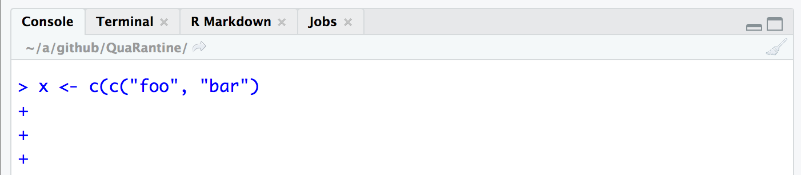

# Frequently asked questions {-}

1. Is the course material available in PDF?

   Yes, click the 'Download' icon and PDF format in the title bar of the main document, as illustrated in the  figure.

   Remember that the course material is a 'work in progress', so the PDF will need to be updated frequently throughout the course. Also, the book is not pretty; that's a task for a separate quarantine!

    ```{r echo = FALSE}
    knitr::include_graphics('images/99-Download-PDF.png')
    ```
    
1. Whenever I press the 'enter' key, the RStudio console keeps saying `+` and doesn't evaluate my expression! See the figure below.

    ```{r echo = FALSE}
    knitr::include_graphics('images/99-console-plus-1.png')
    ```
    
   Notice that you've started a character string with a double `"`, and tried to terminate it with a single quote `'`. Because the quotes do not match, _R_ thinks you're still trying to complete the entry of the variable, and it's letting you know that it is expecting more with the `+` prompt at the begining of the line.
   
   A common variant of this is to open more parentheses than you close, as shown in 
   
    ```{r echo = FALSE}
    
    ```

   The solution is either to complete your entry (by entering a `"` or balancing the parentheses with `)`) or abandon your attempt by pressing `control-C` or the escape key (usually in the top left corner of the keyboard)